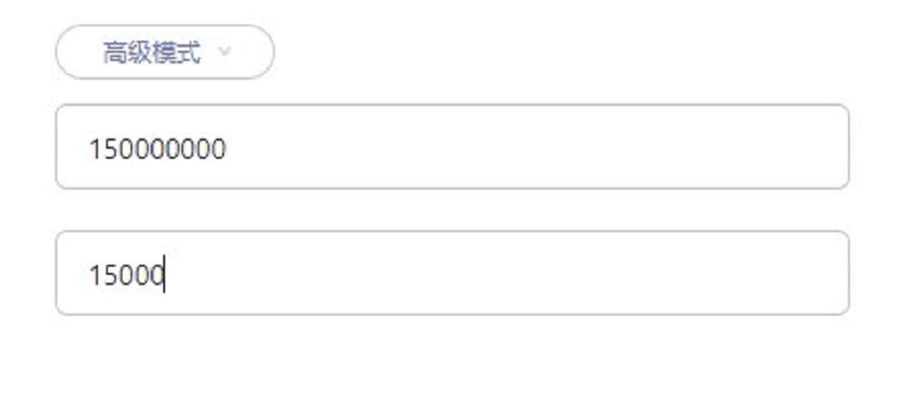
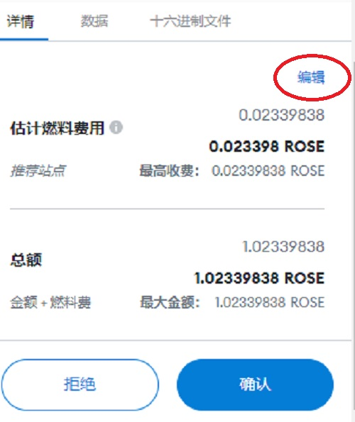
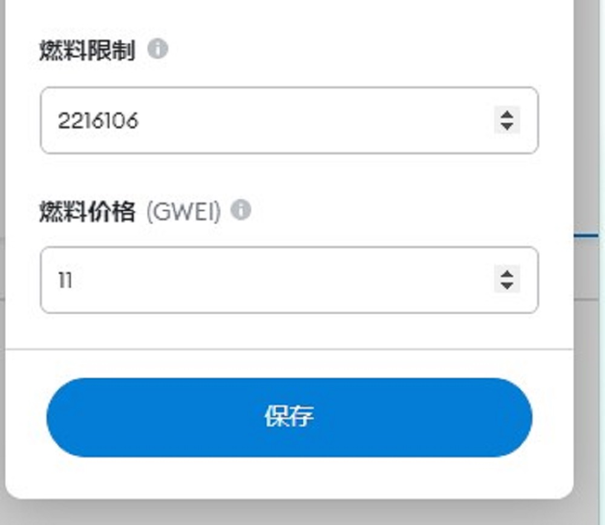

# Gas设置

当区块链拥堵时，需要提高Fee来获得优先权来尽快达成交易。以下介绍如何设置GAS来实现。

操作分两部分，Oasis主网与Emerald互转、Emerald内部操作。

**声明：本文中的建议，为依据撰文时的链上情况做出的判断，用户请根据此方法自行尝试更合适的参数。**

## 一、Oasis主网与Emerald互转

此操作在Chrome插件钱包内，具体使用方式可参照[Oasis与Emerald之间的ROSE划转](../Oasis与Emerald之间的ROSE划转/Oasis与Emerald之间的ROSE划转.md)。

在下图中，手动填入**Fee Amount**及**Fee Gas**，建议150000000/15000。

> 此参数总费用上限为0.15ROSE，数值仅供参考，如持续拥堵，可修改Fee Gas 15000(默认值)为更大的数值；

> 目前非拥堵时段，如使用默认参数，总费用预计小于0.001ROSE。

## 二、Emerald内部操作

可在MetaMask确认时，点击右上角“编辑”按钮，手动进行设置。

也可在确认后，在“活动”标签中，找到进行中的交易，点击“加速”。

调整"燃料价格（GWEI）",默认为**100**，建议在此基础上调高

> 2022/04/11 Damask升级后，Gas Price默认最低从10调整为100。

## 三、GAS计算方式

### 3.1、Oasis主网

Oasis主网内部操作，以及Oasis和Emerald的交互，均按照Oasis主网的设计来进行。

可设置参数：

- Fee Amount：数量单位，可支付的费用总数，单位为nanoROSE（0.000000001ROSE),最低21000；
- Fee Gas：数量单位，一次执行可以使用的最大gas。如Gas数量不足，会导致失败且费用不退。

可计算得出：

- Gas Price：Amount / Gas。如Price过低，节点会拒绝交易，且费用不退。

### 3.2、Emerald

Emerald使用的与以太坊Ethereum同样的Gas机制（此处燃料为ROSE）

- Gas Limit：数量单位，可支付的总gas的个数；
- Gas Price：数量单位，每个gas对应几个GWEI；
- Gwei：数量单位，1Gwei= 1 nano ROSE（0.000000001ROSE)。

最终成本：

- 实际消耗的Gas（个） * Gas Price（个） = Gwei（个），再转换成ROSE数量。

如有疑问或错漏，请在[官方群](https://t.me/oasisnetworkchina)里反馈。

  > 作者：moi 2022/03/18 最新编辑：moi 2022/04/11