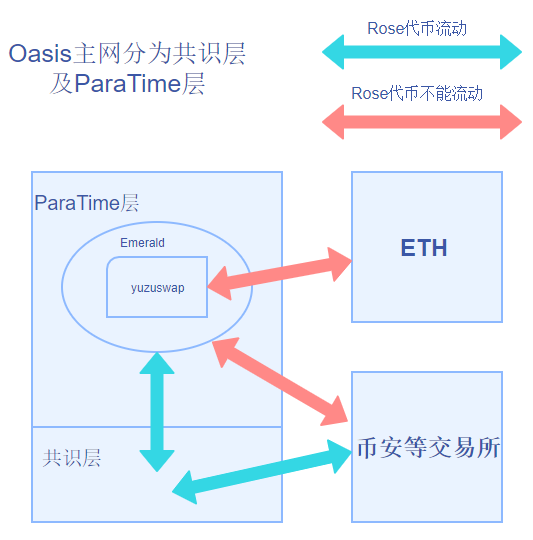
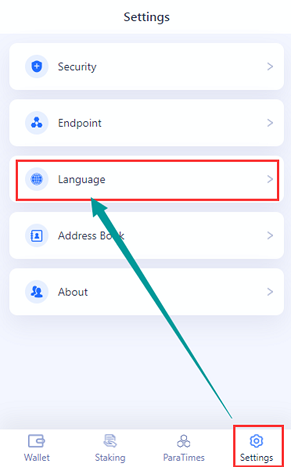
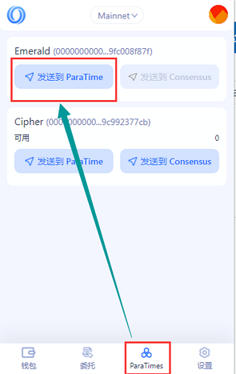
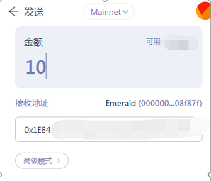
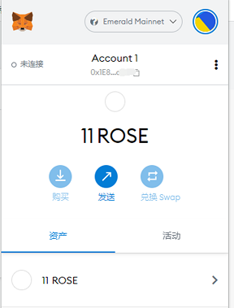
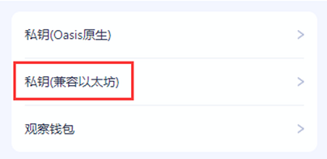
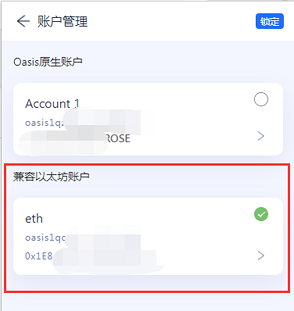
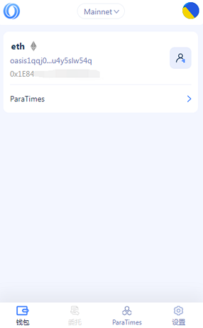
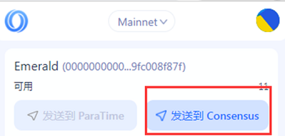
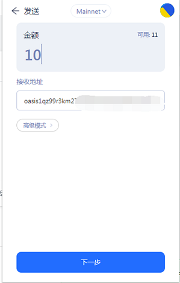

# Oasis与Emerald之间的ROSE划转

## 一、前言

Oasis主网分为共识层及计算层，原生代币ROSE存放于共识层，计算层（即ParaTime层）中用于部署各种应用，其中，Emerald（ParaTimes中的一个）提供EVM的兼容环境，因此可以实现跨链。

YuzuSwap是建立在Emerald上的去中心化交易所，可实现跨链的代币交易（如下图）



如需进行ROSE的交易，需要从Oasis（共识层）转移到ParaTime层（Emerald）。此文将介绍在Chrome插件钱包版中的交互操作。

提醒：转账时请先进行少量转移测试，待确认成功后再进行大额转移。

本文写于20220109，随着生态及的发展，可能会有更便捷的转移操作。

20220208修正：如从Emerald直接转到币安等交易所时发生问题，可以从官网[https://www.oasisscan.com/](https://www.oasisscan.com)查询交易所收款地址的交易记录，依据时间/金额等进行查找对应的txHash。也可进入官方中文群组[https://t.me/oasisnetworkchina](https://t.me/oasisnetworkchina)寻求帮助。

## 二、准备

1、Oasis插件（Chrome浏览器）

[https://chrome.google.com/webstore/detail/oasis-wallet/ppdadbejkmjnefldpcdjhnkpbjkikoip?hl=zh-CN](https://chrome.google.com/webstore/detail/oasis-wallet/ppdadbejkmjnefldpcdjhnkpbjkikoip?hl=zh-CN)

2、Oasis钱包地址（以oasis开头）
如果没有创建过Oasis钱包，可在以下官方Web钱包上创建一个（上一条的插件钱包也可）

[https://wallet.oasisprotocol.org/](https://wallet.oasisprotocol.org/)

3、Metamask插件（Chrome浏览器）（用于查看Emerald网络里的ROSE）

[https://chrome.google.com/webstore/detail/metamask/nkbihfbeogaeaoehlefnkodbefgpgknn?hl=zh-CN](https://chrome.google.com/webstore/detail/metamask/nkbihfbeogaeaoehlefnkodbefgpgknn?hl=zh-CN)

3、ETH钱包地址（以0x开头）

## 三、从Oasis转移到Emerald

打开插件版钱包（假设已经使用Oasis钱包登陆），点击右下角设置，如图所示，可以切换成中文版本



点击底栏“ParaTimes”，查看第一个ParaTime，即Emerald，点击“发送到Emerald”



输入ETH钱包地址，以及想要转移到Emerald的ROSE数量



点击下方“下一步”，等待提示完成，即完成了从Oasis转移到Emerald的过程。

## 四、MetaMask添加Emerald RPC地址

本文以MetaMask的Chrome版钱包为例（app也可同样操作）

```
主网名称：Emerald Mainnet
RPC URL：https://emerald.oasis.dev/
ID:42262
代币：ROSE
```

添加后，在钱包内可以看到刚转入的ROSE



## 五、从Emerald转移ROSE到Oasis

注意：千万不要直接从Emerald转移到交易所的充币地址。会导致有可能无法到账。请务必先从Emerald转移到自己的Oasis钱包后，再从钱包转移到交易所充币地址。

在oasis钱包的右上角，点击切换账号


选择导入


选择兼容以太坊的钱包（即0x开头）



导入成功后，选择此钱包

注意：此时兼容钱包会显示如下图红框中的两个地址，分别以oasis和0x开头。千万不要从交易所及主网将ROSE转移到此Oasis开头的地址！



回到主界面，就发现变了样。



同样切换到ParaTimes，这次选择“发送到Consensus”



输入Oasis钱包地址，点击下一步，等待完成后查看一下钱包是否到账，搞定！


