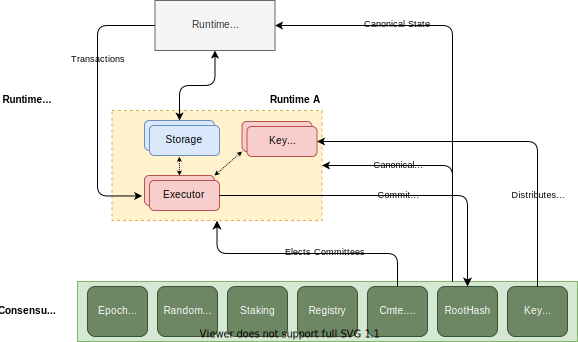
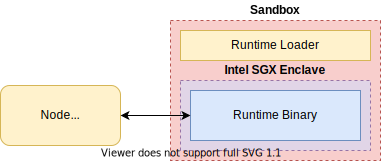

# 运行时

Oasis Core 独立的运行时能够调度和执行有状态的计算并将结果摘要提交到共识层。 除了验证和存储规范运行时状态摘要之外，共识层还充当节点和运行时元数据的注册表、选举运行时计算委员会的调度器和密钥管理器复制的协调器。

## 运行时

运行时实际上是具有共享状态的复制应用程序。 应用程序可以接收来自客户端的事务，并基于这些事务执行任意状态突变。 这种复制的状态和应用程序逻辑与共识层状态和逻辑完全分开存在，但它利用相同的共识层来实现最终性，共识层提供规范状态的来源。 多个运行时可以共享同一个共识层。

在 Oasis Core 中，运行时可以是任何执行运行时主机协议的可执行文件，该协议用于在运行时和 Oasis 核心节点之间进行通信。 可执行文件通常在沙盒环境中运行，唯一的外部接口是运行时主机协议。 执行环境目前包括一个基于 Linux 命名空间的沙箱和 SECCOMP，可选地与英特尔 SGX 飞地相结合以进行机密计算。

将来，这可能会扩展为支持在其自己的虚拟机中运行每个运行时以及使用其他机密计算技术。

## 运营模式

共识层服务和运行时服务之间的关系最好用一个简单的例子来描述，即创建一个 "运行时A"，并接收来自客户的交易（也可参见上图的概述）。

1. 首先需要创建运行时。除了开发将在运行时本身运行的代码之外，我们还需要指定一些与运行时操作相关的元数据，包括唯一的[运行时标识符](https://docs.oasis.io/core/runtime/identifiers)，然后[注册运行时](https://docs.oasis.io/core/consensus/services/registry#register-runtime)。
2.  我们还需要一些节点，它们将实际运行运行时可执行文件并处理来自客户端（计算节点）的任何事务。这些节点当前需要有本地可用的可执行文件，并且必须配置为计算节点。
3.  除了计算节点之外，运行时还需要存储节点来存储其状态。
4.  两种[节点都将在共识层注册](https://docs.oasis.io/core/consensus/services/registry#register-node)，宣布愿意参与Runtime A的运行。
5.  [epoch transition](https://docs.oasis.io/core/consensus/services/epochtime) [committee scheduler](https://docs.oasis.io/core/consensus/services/scheduler)之后， 服务将根据角色将注册的计算和存储节点选举到不同的委员会中。选举是根据 随机信标 提供的熵随机进行的。
6.  客户端可以通过查询共识层来提交交易，以获取给定运行时的当前执行委员会，连接到它，发布交易并等待共识层完成。为了更容易编写客户端，Oasis 节点公开了一个运行时 [client RPC API](https://docs.oasis.io/core/oasis-node/rpc)，它将所有这些功能封装在一个 [SubmitTx](https://pkg.go.dev/github.com/oasisprotocol/oasis-core/go/runtime/client/api?tab=doc#RuntimeClient.SubmitTx) `调用。
7.  事务被批处理并通过事务处理管道进行。最后，将结果保存到存储中，共识层中的 [roothash 服务](https://docs.oasis.io/core/consensus/services/roothash) 在验证计算正确执行且状态为正确地坚持。
8.  计算节点准备好接受下一批，该过程可以从第 6 步开始重复。

请注意，上面的示例描述了*happy path*，即没有失败的场景。所描述的步骤提到了诸如验证计算是否执行*正确*以及该状态*正确存储*之类的事情。共识层实际上是如何知道这一点的？

### 差异检测和解决

确保运行时计算的完整性的关键思想是带有差异检测的复制计算。这基本上意味着任何计算（例如，交易的执行）都是在多个计算节点之间复制的。它们都执行完全相同的功能并产生结果，这些结果必须全部匹配。如果它们不匹配（例如，如果甚至一个节点产生不同的结果），这将被视为一个差异。

在出现差异的情况下，必须使用一个单独的更大的计算委员会来重复计算，决定正确的结果是什么。由于所有的承诺都归于计算节点，任何产生不正确结果的节点都可能会被削减其股份，并可能被从未来的委员会中移除。

鉴于上述情况，复制运行时的另一个约束是它们必须是完全确定的，也就是说，在相同的初始状态下运行的计算，执行相同的输入（事务），必须总是产生相同的输出和新状态。如果一个运行时的执行表现出非确定性，这将表现为差异，因为节点在复制计算时将得出不同的结果。

### 计算委员会的作用和承诺

一个计算节点可以被选入一个执行者委员会，并可能具有以下角色之一。

- 主要执行者节点。在任何给定的回合中，在所有主要执行者节点中选择一个节点作为*交易调度者节点（大致相当于*块提议者*的角色）。
- 后备执行者节点。在共识层确定存在差异的情况下，备份节点可以被激活。

主要和备份执行者委员会的大小，以及其他相关参数，可以在每个运行时间的基础上进行配置。主*节点是将传入的交易批量化为块，并执行状态转换以得出新的状态根。他们以复制的方式执行，所有的主执行器节点在相同的初始状态上执行相同的输入（交易）。

执行后，他们将签署[加密承诺](https://pkg.go.dev/github.com/oasisprotocol/oasis-core/go/roothash/api/commitment?tab=doc)，指定输入、初始状态、输出和结果状态。如果计算发生在一个可信的执行环境（TEE）中，如英特尔SGX，承诺也将包括一个平台证明，证明计算发生在一个特定的TEE中。

共识层中的[roothash服务](https://docs.oasis.io/core/consensus/services/roothash)将收集承诺并验证所有节点确实计算了相同的结果。如前所述，在出现差异的情况下，它将指示被选为*后备的节点来重复计算。

### 存储收据

所有运行时的持久性状态都由存储节点存储。这些节点为计算节点提供一个[Merklized Key-Value Store (MKVS)](https://docs.oasis.io/core/mkvs)。MKVS以加密方式存储由单一根哈希总结的不可变的状态。当一个存储节点存储一个给定的状态更新时，它签署一个收据，说明它正在存储一个特定的根。在接受来自计算节点的承诺之前，这些收据由[roothash服务](https://docs.oasis.io/core/consensus/services/roothash)进行验证。

### 暂停运行时

由于定期维护工作必须在每个纪元转换时进行（例如，选举运行时委员会），该维护的费用由任何注册为特定运行时执行工作的节点支付。费用是按节点注册的纪元数预付的。如果在纪元转换时没有运行时间的委员会，那么该纪元的运行时间将被暂停。如果注册实体不再有足够的股权来支付实体和运行时间的押金，运行时间也会暂停。如果运行时间节点将被注册，并且注册实体有足够的股权，那么运行时间将在纪元转换时被恢复。

### 发出消息

运行时可以[emit messages](https://docs.oasis.io/core/runtime/messages)来指示共识层代表他们做什么。这使得运行时有可能[拥有赌注账户](https://docs.oasis.io/core/consensus/services/staking#runtime-accounts)。

[运行时主机协议](%E8%BF%90%E8%A1%8C%E6%97%B6%20e86e0999f74645d590adcded037d5e09/%E8%BF%90%E8%A1%8C%E6%97%B6%E4%B8%BB%E6%9C%BA%E5%8D%8F%E8%AE%AE%2061563b2a0b444210a0e102f4a0adb3a7.md)

[运行时 ID](%E8%BF%90%E8%A1%8C%E6%97%B6%20e86e0999f74645d590adcded037d5e09/%E8%BF%90%E8%A1%8C%E6%97%B6%20ID%2095418b07e7064a228cabd0d60693d677.md)

[运行时消息](%E8%BF%90%E8%A1%8C%E6%97%B6%20e86e0999f74645d590adcded037d5e09/%E8%BF%90%E8%A1%8C%E6%97%B6%E6%B6%88%E6%81%AF%207da059f8b58c41bf96e958f8de9d5160.md)