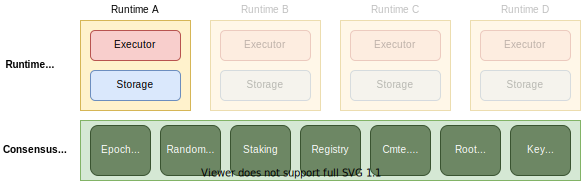

# 00 Oasis 核心开发者文档

## **Development Setup 开发设置**

以下是有关如何设置本地环境构建、运行测试说明以及有关如何为 Oasis Core 组件的本地开发准备测试网络的一些示例。

- 配置开发环境和开发
    - [前提](/dev_support/core/开发核心文档/开发核心文档/01开发设置/配置开发环境和构建/前提.md)
    - [开始构建](/dev_support/core/开发核心文档/开发核心文档/01开发设置/配置开发环境和构建/开始构建.md)
- 运行测试和开发网络
    - [运行测试](/dev_support/core/开发核心文档/开发核心文档/01开发设置/运行测试和开发网络/运行测试.md)
    - [简单运行时间的本地网络运行器](/dev_support/core/开发核心文档/开发核心文档/01开发设置/运行测试和开发网络/本地网络运行.md)
    - [单一验证节点网络](/dev_support/core/开发核心文档/开发核心文档/01开发设置/运行测试和开发网络/单一节点验证网络.md)
    - [部署运行环境](/dev_support/core/开发核心文档/开发核心文档/01开发设置/运行测试和开发网络/部署运行.md)

## 高级组件

在最高级别，Oasis Core 分为两个主要层：共识层和运行时层，如上图所示。

The idea behind the consensus layer is to provide a minimal set of features required to securely operate independent runtimes running in the runtime layer. It provides the following services:

共识层背后的想法是提供安全操作运行在运行时层中的独立运行时所需的最小功能集。 它提供以下服务：

- 基于纪元的时间保持和随机信标。
- 运营 PoS 区块链所需的质押操作。
- 分发公钥和元数据的实体、节点和运行时注册表。
- 运行时委员会调度、承诺处理和最小状态保持。

另外，每个运行时定义自己的状态和状态转换，独立于共识层，只提交简短的证明，证明计算被执行，结果被存储。这意味着运行时的状态和逻辑与共识层完全解耦，而共识层只提供关于什么状态（由Merklized数据结构的加密哈希总结）在任何特定时间点被认为是经典的信息。

有关具体组件及其实现的更多细节，请参见以下章节。

- [共识层](/dev_support/core/开发核心文档/开发核心文档/02高级组件/共识层.md)
    - [交易](/dev_support/core/开发核心文档/开发核心文档/02高级组件/共识层/交易.md)
    - 服务
        - [纪元时间](/dev_support/core/开发核心文档/开发核心文档/02高级组件/共识层/服务/纪元时间.md)
        - [随机信标](/dev_support/core/开发核心文档/开发核心文档/02高级组件/共识层/服务/随机信标.md)
        - [质押](/dev_support/core/开发核心文档/开发核心文档/02高级组件/共识层/服务/质押.mdd)
        - [注册](/dev_support/core/开发核心文档/开发核心文档/02高级组件/共识层/服务/注册.md)
        - [委员会日程安排员](/dev_support/core/开发核心文档/开发核心文档/02高级组件/共识层/服务/委员会日程安排.md)
        - [治理](/dev_support/core/开发核心文档/开发核心文档/02高级组件/共识层/服务/治理.md)
        - [根哈希](/dev_support/core/开发核心文档/开发核心文档/02高级组件/共识层/服务/根哈希.md)
        - [密钥管理](/dev_support/core/开发核心文档/开发核心文档/02高级组件/共识层/服务/密钥管理器.md)
    - [创世文件](https://github.com/oasisprotocol/oasis-core/blob/master/docs/consensus/genesis.md)
    - [交易测试向量](https://github.com/oasisprotocol/oasis-core/blob/master/docs/consensus/test-vectors.md)
- [运行时](/dev_support/core/开发核心文档/开发核心文档/02高级组件/运行时.md)
    - [运行时主机协议](/dev_support/core/开发核心文档/开发核心文档/02高级组件/运行时/运行时主机协议.md)
    - [运行时ID](/dev_support/core/开发核心文档/开发核心文档/02高级组件/运行时/运行时ID.md)
    - [消息](/dev_support/core/开发核心文档/开发核心文档/02高级组件/运行时/运行时消息.md)
- Oasis 节点
    - [RPC](/dev_support/core/开发核心文档/开发核心文档/02高级组件/Oasis节点/RPC.mdd)
    - [Metrics](/dev_support/core/开发核心文档/开发核心文档/02高级组件/Oasis节点/指标.md)
    - [CLI](/dev_support/core/开发核心文档/开发核心文档/02高级组件/Oasis节点/oasis-nodeCLI.md)

## 通用组件

- [编码](/dev_support/core/开发核心文档/开发核心文档/03通用功能/编码.md)
- [密码学](/dev_support/core/开发核心文档/开发核心文档/03通用功能/密码学.md)
- 协议栈
    - [已验证的 gRPC](/dev_support/core/开发核心文档/开发核心文档/03通用功能/经过身份验证的gRPC.md)
- [MKVSMerklized 键值存储 (MKVS)](/dev_support/core/开发核心文档/开发核心文档/03通用功能/Merklized键值存储(MKVS).md)

## 流程

- [架构决策记录](https://github.com/oasisprotocol/adrs)
- [发布流程](/dev_support/core/开发核心文档/开发核心文档/04流程/发布流程.md)
- [版本控制](/dev_support/core/开发核心文档/开发核心文档/04流程/版本控制.md)
- [安全](/dev_support/core/开发核心文档/开发核心文档/04流程/安全.md)