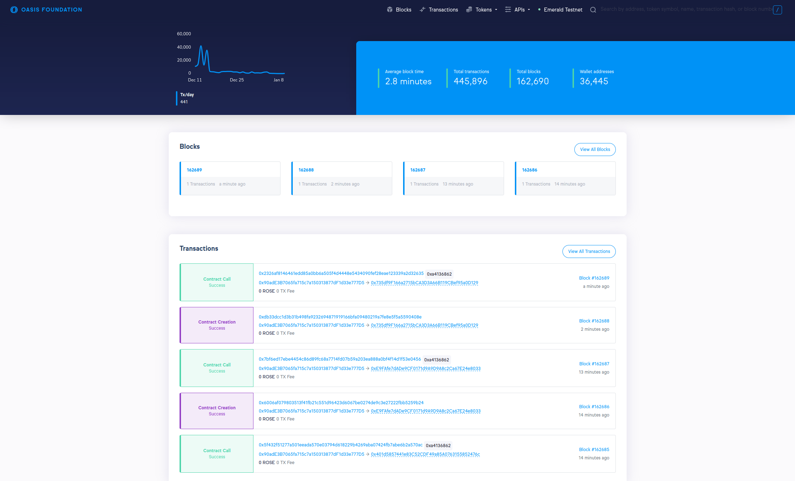

# 在Emerald上编写dapp

本教程将向您展示如何为 Emerald 设置 dapp 开发环境，以便能够在 Oasis Emerald 上编写和部署 dapp。

我们将引导您完成 Hardhat 和 Truffle 配置，以及对于那些喜欢更简单的纯 Web 界面的人，如何配置Remix IDE 。Oasis Emerald 公开了与 EVM 兼容的接口，因此与原始以太坊网络相比，编写 dapp 并没有太大区别！

## Oasis 共识层 and Emerald ParaTime

Oasis 网络由共识层和许多称为 ParaTimes 的第 2 层链组成。Emerald 是实现以太坊虚拟机 (EVM) 的 ParaTime。

Emerald 中的最小和预期区块时间是**6 秒**。任何 Emerald 交易都至少需要这个时间才能执行。

原生 Oasis 地址是 Bech32 编码的 (例如`oasis1qpupfu7e2n6pkezeaw0yhj8mcem8anj64ytrayne`)
而 Emerald 支持 Bech32 编码和以太坊兼容的十六进制编码地址(例如 `0x90adE3B7065fa715c7a150313877dF1d33e777D5`). 用于签署交易的底层算法是共识层上的[Ed25519]以及Emerald 中的[Ed25519](https://en.wikipedia.org/wiki/EdDSA#Ed25519)和[ECDSA](https://en.wikipedia.org/wiki/Elliptic_Curve_Digital_Signature_Algorithm)。Ed25519 方案主要由 Emerald 计算节点用于管理其计算奖励。要在 Emerald 上签署与 dapp 相关的交易，您可能需要使用 ECDSA，因为这是以太坊钱包和库支持的事实上的方案。

最后，不允许 ParaTimes 直接访问存储在共识层地址中的代币。您需要将代币从您的共识账户**存入** Emerald 。

## 测试网和主网

与其他一些区块链类似，Oasis 网络目前有两个主要的公共部署：[主网](https://docs.oasis.dev/general/oasis-network/network-parameters)和[测试网](https://docs.oasis.dev/general/foundation/testnet/)。原生代币分别称为 ROSE 和 TEST。每个网络环境都有其独特的状态、一组不同的验证器和 ParaTime。主网的状态被认为是无限期不可变的，而测试网上的数据将来可能会被擦除。

Emerald ParaTime 的部署方式类似：[Emerald 主网](https://docs.oasis.dev/general/developer-resources/emerald-paratime/#mainnet)部署在 Oasis 主网网络上，而[Emerald 测试网](https://docs.oasis.dev/general/developer-resources/emerald-paratime/#testnet)部署在 Oasis 测试网网络上。主网上的Emerald 状态是稳定的。测试网除了运行不稳定版本的代码和容易出现错误外，还可以在 Emerald ParaTime 层或 Oasis 测试网网络层面上故意抹掉状态。。

> 警告 **永远不要在测试网上部署生产服务**  
因为将来可以擦除测试网Testnet 状态，所以您**永远不应该在 Testnet 上部署生产服务**！

> 提示  
出于测试目的，请访问我们的[Testnet 水龙头](https://faucet.testnet.oasis.dev/)以获取一些 TEST，然后您可以在 Emerald Testnet 上使用它们来支付 gas 费用。水龙头支持将 TEST 发送到您的共识层地址或您在 ParaTime 内的地址。

## 本地化运行私有 Oasis 网络

为方便 dapp 开发和测试，Oasis 团队准备了[oasisprotocol/emerald-dev](https://hub.docker.com/r/oasisprotocol/emerald-dev) Docker 映像，它为您带来了完整的 Oasis 堆栈本地部署。该网络与主网或测试网隔离，包括：

- 单个 Oasis 验证节点，出块时间为 1 秒，
- 三个运行 Emerald ParaTime 的 Oasis 计算节点，
- 带有事务索引器的 Emerald Web3 网关，
- 为您填充初始测试帐户的帮助脚本。

要运行doker镜像，请执行：

```
docker run -it -p8545:8545 -p8546:8546 oasisprotocol/emerald-dev

```

一段时间后，将看到如下内容：

```
emerald-dev 2022-03-11-git38da200 (oasis-core: 22.0, emerald-paratime: 7.1.0-rc1, emerald-web3-gateway: 2.0.0-rc1-git38da200)

Starting oasis-net-runner with Emerald ParaTime...
Starting postgresql...
Starting emerald-web3-gateway...
Populating account(s) (this might take a moment)...

Available Accounts
==================
(0) 0x75eCF0d4496C2f10e4e9aF3D4d174576Ee9010E2 (100 ROSE)
(1) 0x903a7dce5a26a3f4DE2d157606c2191740Bc4BC9 (100 ROSE)
(2) 0xF149ad5CBFfD92ba84F5784106f6Cb071A32a1b8 (100 ROSE)
(3) 0x2315F40C1122400Df55483743B051D2997ef0a62 (100 ROSE)
(4) 0xf6FdcacbA93A428A07d27dacEf1fBF25E2C65B0F (100 ROSE)

Private Keys
==================
(0) 0x160f52faa5c0aecfa26c793424a04d53cbf23dcad5901ce15b50c2e85b9d6ca7
(1) 0x0ba685723b47d8e744b1b70a9bea9d4d968f60205385ae9de99865174c1af110
(2) 0xfa990cf0c22af455d2734c879a2a844ff99bd779b400bb0e2919758d1be284b5
(3) 0x3bf225ef73b1b56b03ceec8bb4dfb4830b662b073b312beb7e7fec3159b1bb4f
(4) 0xad0dd7ceb896fd5f5ddc76d56e54ee6d5c2a3ffeac7714d3ef544d3d6262512c

HD Wallet
==================
Mnemonic:       bench remain brave curve frozen verify dream margin alarm world repair innocent
Base HD Path:   m/44'/60'/0'/0/%d

WARNING: Emerald is running in ephemeral mode. The chain state will be lost after you quit!

Listening on <http://localhost:8545> and ws://localhost:8546

```

熟悉本地 dapp 环境的人会发现上面的输出类似于`geth --dev`or`ganache-cli`命令或`geth-dev-assistant`npm 包。[emerald-dev](https://hub.docker.com/r/oasisprotocol/emerald-dev)将在本地启动一个私有 Oasis 网络，生成和填充测试帐户，并使以下 Web3 端点可供您使用：

- `http://localhost:8545`
- `ws://localhost:8546`

> 提示  
如果您喜欢每次都使用相同的助记词（例如，出于测试目的）或只填充一个钱包，请使用`-to`标志并传递助记词或钱包地址。例如

```
docker run -it -p8545:8545 -p8546:8546 oasisprotocol/emerald-dev -to "bench remain brave curve frozen verify dream margin alarm world repair innocent"
docker run -it -p8545:8545 -p8546:8546 oasisprotocol/emerald-dev -to "0x75eCF0d4496C2f10e4e9aF3D4d174576Ee9010E2"
```

> 危险  
[emerald-dev](https://hub.docker.com/r/oasisprotocol/emerald-dev)以临时模式运行。退出 Docker 容器后，任何智能合约和钱包余额都将丢失！

## 通过Hardhat在Emerald上创建dapp

让我们开始用 Hardhat 编写我们的 dapp。我们将为一个流行的dapp开发模式打下基础，包括TypeScript绑定的测试和以后的前端应用。

首先，确保您安装了[Node.js](https://nodejs.org/)，并且您已经拥有`npm`并且`npx` 随时可用。然后运行：

```
npx hardhat init

```

选择该`Create an advanced sample project that uses TypeScript`选项并输入项目的根目录。您可以将其他选项保留为默认值。一段时间后，Hardhat 将完成下载依赖项并创建一个简单的欢迎 dapp。

要在本地编译、部署和测试示例项目的智能合约，请移至项目目录并键入：

```
$ npx hardhat compile
Compiling 2 files with 0.8.4
Generating typings for: 2 artifacts in dir: typechain for target: ethers-v5
Successfully generated 5 typings!
Compilation finished successfully

$ npx hardhat test
No need to generate any newer typings.

  Greeter
Deploying an Emerald Greeter with greeting: Hello, world!
Changing greeting from 'Hello, world!' to 'Hola, mundo!'
    ✓ Should return the new greeting once it's changed (613ms)

  1 passing (614ms)

```

Hardhat已经配备了一个内置的EVM，每次我们在没有参数的情况下调用`hardhat test`时，它都会从头开始启动。它用ETH填充了20个账户，并将它们注册到测试中使用的 [ethers.js](https://docs.ethers.io/v5/) 实例。

接下来，让我们看看如何为 Emerald 配置 Hardhat。为方便起见，我们为环境变量分配`PRIVATE_KEY`一个十六进制编码的 Emerald 钱包私钥，其中包含用于支付Gas费的代币。如果您正在运行 [emerald-dev](https://hub.docker.com/r/oasisprotocol/emerald-dev)，请使用五个生成的私钥中的任何一个。

```
export PRIVATE_KEY="YOUR_0x_EMERALD_PRIVATE_KEY"

```

接下来，我们配置三个网络：`emerald_local`、`emerald_testnet`和 `emerald_mainnet`。打开`hardhat.config.ts`并替换`networks`字段以匹配以下内容：

```
networks: {
    emerald_local: {
      url: "<http://localhost:8545>",
      accounts:
        process.env.PRIVATE_KEY !== undefined ? [process.env.PRIVATE_KEY] : [],
    },
    emerald_testnet: {
      url: "<https://testnet.emerald.oasis.dev>",
      accounts:
        process.env.PRIVATE_KEY !== undefined ? [process.env.PRIVATE_KEY] : [],
    },
    emerald_mainnet: {
      url: "<https://emerald.oasis.dev>",
      accounts:
        process.env.PRIVATE_KEY !== undefined ? [process.env.PRIVATE_KEY] : [],
    },
  },

```

接下来，我们将 mocha 测试的默认超时时间从 20 秒增加到 60 秒。如果您仅在 [emerald-dev](https://hub.docker.com/r/oasisprotocol/emerald-dev)上测试您的合约，则不需要此步骤，但 Testnet 需要此步骤以避免超时。将以下块附加到`config`对象：

```
mocha: {
  timeout: 60000
}

```

> 提示  
`geth --dev`和`ganache-cli`工具使用所谓的“即时挖掘”模式。在这种模式下，当内存池中发生新事务时，会立即挖掘一个新块。Oasis Mainnet 和 Testnet Networks 和[emerald-dev](https://hub.docker.com/r/oasisprotocol/emerald-dev)都不支持这种模式，并且至少在 1 秒块时间过去之后，新块将始终被挖掘。

现在，通过选择我们上面配置的`emerald_local`网络，将合同部署到本地的emerald-dev Docker容器，并运行测试。

```
$ npx hardhat run scripts/deploy.ts --network emerald_local
No need to generate any newer typings.
Greeter deployed to: 0x4e1de2f6cf4e57a8f55b4a5dd1fce770db734962

$ npx hardhat test --network emerald_local
No need to generate any newer typings.

  Greeter
    ✓ Should return the new greeting once it's changed (6017ms)

  1 passing (6s)

```

接下来，你可以尝试把合同部署到Testnet上。把你的`PRIVATE_KEY`环境变量暂时替换成你的Testnet环境变量，然后使用`emerald_testnet`网络来部署合同。同样地，你也可以运行测试。

```
$ PRIVATE_KEY="0xYOUR_TESTNET_PRIVATE_KEY" npx hardhat run scripts/deploy.ts --network emerald_testnet
No need to generate any newer typings.
Greeter deployed to: 0x735df9F166a2715bCA3D3A66B119CBef95a0D129

$ PRIVATE_KEY="0xYOUR_TESTNET_PRIVATE_KEY" npx hardhat test --network emerald_testnet
No need to generate any newer typings.

  Greeter
    ✓ Should return the new greeting once it's changed (21016ms)

  1 passing (6s)

```

恭喜，您刚刚将您的第一个智能合约部署到公共 Emerald 测试网网络！ 如果您不确定您的合约是否已成功部署，您可以在 Emerald 区块浏览器（主网、测试网）上监控交易。 该工具为所有 Emerald 账户、区块、交易建立索引，甚至提供简洁的用户界面来浏览 ERC20 代币和 ERC721 NFT 等 ETH 特定信息。




最后，通过选择`emerald_mainnet` 网络和相应的私钥，我们可以将合约部署在主网上：

```
$ PRIVATE_KEY="0xYOUR_MAINNET_PRIVATE_KEY" npx hardhat run scripts/deploy.ts --network emerald_mainnet
No need to generate any newer typings.
Greeter deployed to: 0x6e8e9e0DBCa4EF4a65eBCBe4032e7C2a6fb7C623

```

## 通过Truffle在Emerald上创建dapp

Truffle 及其随附的 web3.js 库是另一种流行的智能合约部署工具。 让我们按照官方 Truffle 的快速入门指南，拆箱 MetaCoin 示例：

```
$ mkdir MetaCoin
$ cd MetaCoin
$ npx truffle unbox metacoin

Starting unbox...
=================

✔ Preparing to download box
✔ Downloading
✔ Cleaning up temporary files
✔ Setting up box

Unbox successful, sweet!

Commands:

  Compile contracts: truffle compile
  Migrate contracts: truffle migrate
  Test contracts:    truffle test

```

编译和测试合约类型:

```
$ npx truffle test
Using network 'test'.

Compiling your contracts...
===========================
> Compiling ./test/TestMetaCoin.sol
> Artifacts written to /tmp/test--1052348-l4q3zOSy9nRA
> Compiled successfully using:
   - solc: 0.5.16+commit.9c3226ce.Emscripten.clang

  TestMetaCoin
    ✓ testInitialBalanceUsingDeployedContract (112ms)
    ✓ testInitialBalanceWithNewMetaCoin (106ms)

  Contract: MetaCoin
    ✓ should put 10000 MetaCoin in the first account (59ms)
    ✓ should call a function that depends on a linked library (78ms)
    ✓ should send coin correctly (185ms)

  5 passing (6s)

```

这会在后台生成一个 Truffle Develop 区块链实例，其中包含多个预填充的 ETH 账户并运行测试。

现在，让我们添加对 Truffle 的支持，以读取存储在环境变量中的私钥。 添加`@truffle/hdwallet-provider`包：

```
$ npm i @truffle/hdwallet-provider --save-dev

```

通过在`truffle-config.js` 的开头添加以下行来导入库：

`const HDWalletProvider = require("@truffle/hdwallet-provider");`

打开 `truffle-config.js` 并配置 `emerald_local`、`emerald_testnet` 和 `emerald_mainnet` 网络：

```
emerald_local: {
  url: "<http://localhost:8545>",
  provider: function() {
    return new HDWalletProvider(process.env.PRIVATE_KEYS.split(","), "<http://localhost:8545>");
  },
  network_id: "*"
},
emerald_testnet: {
  url: "<https://testnet.emerald.oasis.dev:8545>",
  provider: function() {
    return new HDWalletProvider(process.env.PRIVATE_KEY, "<https://testnet.emerald.oasis.dev>");
  },
  network_id: "*"
},
emerald_mainnet: {
  url: "<https://emerald.oasis.dev:8545>",
  provider: function() {
    return new HDWalletProvider(process.env.PRIVATE_KEY, "<https://emerald.oasis.dev>");
  },
  network_id: "*"
}

```

MetaCoin 示例有些具体，因为它需要至少两个私钥来运行令牌转移测试。 这就是为什么我们在上面的 emerald_local 网络配置中使用 .split(",") 并将两个私钥分配给环境变量。 如果您正在运行 emerald-dev，请复制并粘贴任意两个生成的私钥。

```
export PRIVATE_KEYS="0xYOUR_FIRST_EMERALD_PRIVATE_KEY,0xYOUR_SECOND_EMERALD_PRIVATE_KEY"

```

当我们运行测试时，Truffle 将部署合约及其依赖项并多次调用合约，因此可能需要一些时间才能完成。

```
$ truffle test --network emerald_local
Using network 'emerald_local'.

Compiling your contracts...
===========================
> Compiling ./test/TestMetaCoin.sol
> Artifacts written to /tmp/test--1083354-x87wt3FdmfDE
> Compiled successfully using:
   - solc: 0.5.16+commit.9c3226ce.Emscripten.clang

  TestMetaCoin
    ✓ testInitialBalanceUsingDeployedContract (1091ms)
    ✓ testInitialBalanceWithNewMetaCoin (913ms)

  Contract: MetaCoin
    ✓ should put 10000 MetaCoin in the first account (349ms)
    ✓ should call a function that depends on a linked library (677ms)
account one: 0x90adE3B7065fa715c7a150313877dF1d33e777D5
account two: 0x33a8Ba274FEdFeed6A08d09eC524a1E1A6Da8262
    ✓ should send coin correctly (2795ms)

  5 passing (26s)

```

为将合约部署到测试网并最终部署到主网，请运行 `migrate` Truffle 命令并相应地使用 `emerald_testnet` 或 `emerald_mainnet`网络。 对于主网，您将运行类似这样的程序，并在几轮内 - 根据网络拥塞情况 - 将部署合约：

```
$ PRIVATE_KEY=0xYOUR_MAINNET_PRIVATE_KEY truffle migrate --network emerald_mainnet

Compiling your contracts...
===========================
> Everything is up to date, there is nothing to compile.

Starting migrations...
======================
> Network name:    'emerald_mainnet'
> Network id:      42262
> Block gas limit: 21000000 (0x1406f40)

1_initial_migration.js
======================

   Deploying 'Migrations'
   ----------------------
   > transaction hash:    0x1630945ac8abfe6395a2e2627bd0acfffcf4bda9e107943cb3e4d6ef1d0905d4
   > Blocks: 1            Seconds: 44
   > contract address:    0xFaeA7eda8Be7AC83f811019094D0065D28F52c7c
   > block number:        93914
   > block timestamp:     1642176860
   > account:             0x90adE3B7065fa715c7a150313877dF1d33e777D5
   > balance:             0
   > gas used:            209087 (0x330bf)
   > gas price:           0 gwei
   > value sent:          0 ETH
   > total cost:          0 ETH

   > Saving migration to chain.
   > Saving artifacts
   -------------------------------------
   > Total cost:                   0 ETH

2_deploy_contracts.js
=====================

   Deploying 'ConvertLib'
   ----------------------
   > transaction hash:    0xf2c53938773c316051f4ce98395e5df21cfcf0c686f634c1079725e04b9c556c
   > Blocks: 2            Seconds: 80
   > contract address:    0xA0FB05d6Ce497beb162C4EbA4F203544B18A3f31
   > block number:        93918
   > block timestamp:     1642177009
   > account:             0x90adE3B7065fa715c7a150313877dF1d33e777D5
   > balance:             0
   > gas used:            121235 (0x1d993)
   > gas price:           0 gwei
   > value sent:          0 ETH
   > total cost:          0 ETH

   Linking
   -------
   * Contract: MetaCoin <--> Library: ConvertLib (at address: 0xA0FB05d6Ce497beb162C4EbA4F203544B18A3f31)

   Deploying 'MetaCoin'
   --------------------
   > transaction hash:    0x2c5e8177df03d643e56a37b64cbe660420b114ffec097dc5d793bfc666af8e16
   > Blocks: 2            Seconds: 60
   > contract address:    0x5a1C04012bc233c898aebb8BB4353F80D96f3dD2
   > block number:        93920
   > block timestamp:     1642177073
   > account:             0x90adE3B7065fa715c7a150313877dF1d33e777D5
   > balance:             0
   > gas used:            361168 (0x582d0)
   > gas price:           0 gwei
   > value sent:          0 ETH
   > total cost:          0 ETH

   > Saving migration to chain.
   > Saving artifacts
   -------------------------------------
   > Total cost:                   0 ETH

Summary
=======
> Total deployments:   3
> Final cost:          0 ETH

```

在上面的输出中，MetaCoin 合约已成功部署到主网上的 `0x5a1C04012bc233c898aebb8BB4353F80D96f3dD2` 地址。

## 使用 Remix 在 Emerald 上创建 dapp - 以太坊 IDE

Remix 是一种流行的 Web IDE，用于在以太坊网络上快速开发、部署和测试智能合约。 我们将结合 MetaMask 使用它来访问网络设置和您的钱包以签署和提交交易。

如没做过，首先要为你的浏览器安装MetaMask插件。导入你的钱包并配置Emerald Testnet和Mainnet网络。如果你想连接到 emerald-dev 容器，也要配置本地网络。

第一次打开 Remix 时，它会自动创建一个示例项目。让我们打开其中一个合约并在“Solidity 编译器”选项卡中编译它。


接下来，在“Deploy and Run Transactions”选项卡中，选择“Injected Web3”环境。将出现一个 MetaMask 弹出窗口，您必须将一个或多个帐户与 Remix 连接。连接成功后，单击“部署”按钮。MetaMask 弹出窗口再次出现，您必须查看交易、gas 选项并最终确认交易。


如果一切顺利，您的交易将使用 MetaMask 中的选定帐户和相应的 Emerald 网络进行部署。


> 提示  
有时，gas limit 估计函数可能会从所需的值中计算出稍低的值。在这种情况下，请尝试手动将 gas 限制提高 10% 或 20%。

恭喜！现在您可以开始在 Oasis Emerald 区块链上开发自己的智能合约了！[如果您有任何问题，请随时在#emerald-paratime Discord 频道](https://discord.gg/pJdWeVtmHT)上与我们分享。

## 故障排除

### 在测试网或主网上部署我的合约超时

Emerald 验证器，类似于以太坊验证器，按 gas 价格订购交易的执行。 当部署一个合约并且部署超时时，首先要再等待几轮，以确保最终不会部署该合约。

接下来，检查您的 `gasPrice` 是否至少为 10 nROSE，这是 Emerald 所需的最低 gas 价格。 该值应该已经由 web3 端点自动传播，但您的部署配置可能已忽略它。

最后，考虑将 Hardhat/Truffle 配置文件中的 gasPrice 参数增加一小部分（例如 10% 或 20%）。 这将需要你钱包中的更多 ROSE 来部署合约，但你也会增加你的交易被包含在区块中的机会。

### 合同执行失败，该如何调试出问题？

如果您使用的是测试网或主网，请尝试通过在 Emerald 区块浏览器（主网、测试网）上找到它来调试您的交易：


在某些情况下，Emerald 区块浏览器上的交易结果可能会卡在 `Error: (Awaiting internal transactions for reason)`。 在这种情况下或其他共识层 ↔ ParaTime 问题的情况下，尝试在 Oasis Scan（主网、测试网）上找到您的 Emerald 交易，这主要是一个共识层浏览器，但也提供了对 ParaTime 交易的一些内省。 一旦您发现失败的 Emerald 交易，`Status` 字段应包含更详细的错误描述，例如：


Last updated on 8/22/2022