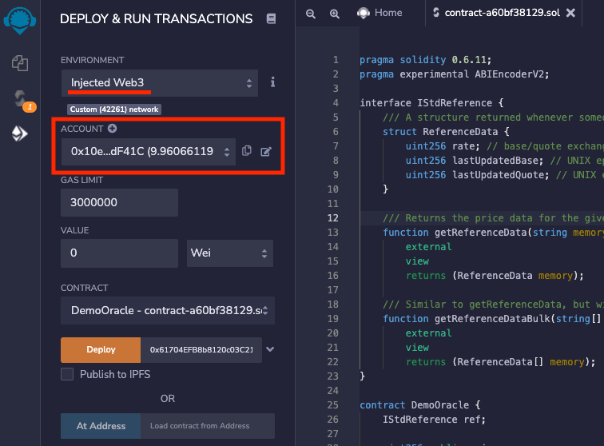

# 集成BAND预言机智能合约

本指南将解释如何从 Emerald 上的另一个 Solidity 智能合约查询 Band Protocol 参考数据智能合约。****

### **什么是 Band 协议？**

[Band Protocol](https://bandprotocol.com/)是一个跨链数据预言机平台，将现实世界的数据和 API 聚合并连接到智能合约。您可以在[此处](https://docs.bandchain.org/)阅读有关该协议的具体细节的更多信息 。

### 部署Oracle

1. 按照[此链接](https://remix.ethereum.org/?#code=cHJhZ21hIHNvbGlkaXR5IDAuNi4xMTsKcHJhZ21hIGV4cGVyaW1lbnRhbCBBQklFbmNvZGVyVjI7CgppbnRlcmZhY2UgSVN0ZFJlZmVyZW5jZSB7CiAgICAvLy8gQSBzdHJ1Y3R1cmUgcmV0dXJuZWQgd2hlbmV2ZXIgc29tZW9uZSByZXF1ZXN0cyBmb3Igc3RhbmRhcmQgcmVmZXJlbmNlIGRhdGEuCiAgICBzdHJ1Y3QgUmVmZXJlbmNlRGF0YSB7CiAgICAgICAgdWludDI1NiByYXRlOyAvLyBiYXNlL3F1b3RlIGV4Y2hhbmdlIHJhdGUsIG11bHRpcGxpZWQgYnkgMWUxOC4KICAgICAgICB1aW50MjU2IGxhc3RVcGRhdGVkQmFzZTsgLy8gVU5JWCBlcG9jaCBvZiB0aGUgbGFzdCB0aW1lIHdoZW4gYmFzZSBwcmljZSBnZXRzIHVwZGF0ZWQuCiAgICAgICAgdWludDI1NiBsYXN0VXBkYXRlZFF1b3RlOyAvLyBVTklYIGVwb2NoIG9mIHRoZSBsYXN0IHRpbWUgd2hlbiBxdW90ZSBwcmljZSBnZXRzIHVwZGF0ZWQuCiAgICB9CgogICAgLy8vIFJldHVybnMgdGhlIHByaWNlIGRhdGEgZm9yIHRoZSBnaXZlbiBiYXNlL3F1b3RlIHBhaXIuIFJldmVydCBpZiBub3QgYXZhaWxhYmxlLgogICAgZnVuY3Rpb24gZ2V0UmVmZXJlbmNlRGF0YShzdHJpbmcgbWVtb3J5IF9iYXNlLCBzdHJpbmcgbWVtb3J5IF9xdW90ZSkKICAgICAgICBleHRlcm5hbAogICAgICAgIHZpZXcKICAgICAgICByZXR1cm5zIChSZWZlcmVuY2VEYXRhIG1lbW9yeSk7CgogICAgLy8vIFNpbWlsYXIgdG8gZ2V0UmVmZXJlbmNlRGF0YSwgYnV0IHdpdGggbXVsdGlwbGUgYmFzZS9xdW90ZSBwYWlycyBhdCBvbmNlLgogICAgZnVuY3Rpb24gZ2V0UmVmZXJlbmNlRGF0YUJ1bGsoc3RyaW5nW10gbWVtb3J5IF9iYXNlcywgc3RyaW5nW10gbWVtb3J5IF9xdW90ZXMpCiAgICAgICAgZXh0ZXJuYWwKICAgICAgICB2aWV3CiAgICAgICAgcmV0dXJucyAoUmVmZXJlbmNlRGF0YVtdIG1lbW9yeSk7Cn0KCmNvbnRyYWN0IERlbW9PcmFjbGUgewogICAgSVN0ZFJlZmVyZW5jZSByZWY7CgogICAgdWludDI1NiBwdWJsaWMgcHJpY2U7CgogICAgY29uc3RydWN0b3IoSVN0ZFJlZmVyZW5jZSBfcmVmKSBwdWJsaWMgewogICAgICAgIHJlZiA9IF9yZWY7CiAgICB9CgogICAgZnVuY3Rpb24gZ2V0UHJpY2UoKSBleHRlcm5hbCB2aWV3IHJldHVybnMgKHVpbnQyNTYpewogICAgICAgIElTdGRSZWZlcmVuY2UuUmVmZXJlbmNlRGF0YSBtZW1vcnkgZGF0YSA9IHJlZi5nZXRSZWZlcmVuY2VEYXRhKCJXQlRDIiwiVVNEIik7CiAgICAgICAgcmV0dXJuIGRhdGEucmF0ZTsKICAgIH0KCiAgICBmdW5jdGlvbiBnZXRNdWx0aVByaWNlcygpIGV4dGVybmFsIHZpZXcgcmV0dXJucyAodWludDI1NltdIG1lbW9yeSl7CiAgICAgICAgc3RyaW5nW10gbWVtb3J5IGJhc2VTeW1ib2xzID0gbmV3IHN0cmluZ1tdKDIpOwogICAgICAgIGJhc2VTeW1ib2xzWzBdID0gIldCVEMiOwogICAgICAgIGJhc2VTeW1ib2xzWzFdID0gIkVUSCI7CgogICAgICAgIHN0cmluZ1tdIG1lbW9yeSBxdW90ZVN5bWJvbHMgPSBuZXcgc3RyaW5nW10oMik7CiAgICAgICAgcXVvdGVTeW1ib2xzWzBdID0gIlVTRCI7CiAgICAgICAgcXVvdGVTeW1ib2xzWzFdID0gIlVTRCI7CiAgICAgICAgSVN0ZFJlZmVyZW5jZS5SZWZlcmVuY2VEYXRhW10gbWVtb3J5IGRhdGEgPSByZWYuZ2V0UmVmZXJlbmNlRGF0YUJ1bGsoYmFzZVN5bWJvbHMscXVvdGVTeW1ib2xzKTsKCiAgICAgICAgdWludDI1NltdIG1lbW9yeSBwcmljZXMgPSBuZXcgdWludDI1NltdKDIpOwogICAgICAgIHByaWNlc1swXSA9IGRhdGFbMF0ucmF0ZTsKICAgICAgICBwcmljZXNbMV0gPSBkYXRhWzFdLnJhdGU7CgogICAgICAgIHJldHVybiBwcmljZXM7CiAgICB9CgogICAgZnVuY3Rpb24gc2F2ZVByaWNlKHN0cmluZyBtZW1vcnkgYmFzZSwgc3RyaW5nIG1lbW9yeSBxdW90ZSkgZXh0ZXJuYWwgewogICAgICAgIElTdGRSZWZlcmVuY2UuUmVmZXJlbmNlRGF0YSBtZW1vcnkgZGF0YSA9IHJlZi5nZXRSZWZlcmVuY2VEYXRhKGJhc2UscXVvdGUpOwogICAgICAgIHByaWNlID0gZGF0YS5yYXRlOwogICAgfQp9Cg==)进行混音。该链接包含一个编码的示例`DemoOracle.sol`合同。
2. 使用编译器版本 `0.6.11` 编译合约。
3. 切换到 Remix 的 Deploy 选项卡。
    1. 在左上角的 Environment 下拉菜单中选择“Injected Web3”以连接 Metamask。
    2. 确保 Metamask 已连接到 Emerald（测试网/主网）网络。
    
    
    
4.  将 Emerald Testnet Band 参考数据聚合器合约地址 ( `0x61704EFB8b8120c03C210cAC5f5193BF8c80852a`) 输入到`DemoOracle`构造函数并部署合约。您可以在主网上访问参考数据聚合器合约`0xDA7a001b254CD22e46d3eAB04d937489c93174C3`。

Remix的左下角会出现一个与合约交互的界面。

### **获得比率**

单击 `getPrice` 按钮将返回 WBTC 的当前美元价格。 该函数在Band引用数据合约上调用`getReferenceData(string memory_base, string memory_quote)`，传入“WBTC”和“USD”，表示WBTC为base，USD为报价。 返回的费率是基数/报价乘以 1e18。

请注意，`DemoOracle`合同只返回最新的汇率，但参考合同也返回基准和报价参考的最后一次更新的值。

价格被1e18抵消。测试时的返回值为`39567000000000000000000`。乘以 1e-18 得到参考合约给出的当前美元价格，39567.00 WBTC/USD。

单击该`getMultiPrices`按钮会在同一调用中返回多个报价，在本例中为 WBTC/USD 和 ETH/USD。此函数调用`getReferenceDataBulk(string[] memory _bases, string[] memory _quotes)`波段参考数据合约，传递“WBTC”和“ETH”作为基准，“USD”作为报价。这将返回以美元为单位的当前 WBTC 和 ETH 价格，作为整数数组。该调用还仅返回汇率（乘以 1e18），但可以修改为返回基数和报价的最后更新时间。

该`savePrice`函数会将传递给它的任何基本/报价率保存在名为 的存储变量中`price`。此存储数据仅在调用“savePrice”函数时才会更新，因此`price`除非重复调用此函数，否则保存的值将过时。

### **主网参考数据合约**

您可以在 0xDA7a001b254CD22e46d3eAB04d937489c93174C3 访问主网上的参考数据聚合器[合约](https://explorer.emerald.oasis.dev/address/0xDA7a001b254CD22e46d3eAB04d937489c93174C3/transactions)。

### **可参考数据**

[您可以在此处查看波段标准数据集网站](https://data.bandprotocol.com/)上的可用参考数据。

### **DemoOracle.sol 合约示例**

[DemoOracle.sol contract example in Remix](https://remix.ethereum.org/?#code=cHJhZ21hIHNvbGlkaXR5IDAuNi4xMTsKcHJhZ21hIGV4cGVyaW1lbnRhbCBBQklFbmNvZGVyVjI7CgppbnRlcmZhY2UgSVN0ZFJlZmVyZW5jZSB7CiAgICAvLy8gQSBzdHJ1Y3R1cmUgcmV0dXJuZWQgd2hlbmV2ZXIgc29tZW9uZSByZXF1ZXN0cyBmb3Igc3RhbmRhcmQgcmVmZXJlbmNlIGRhdGEuCiAgICBzdHJ1Y3QgUmVmZXJlbmNlRGF0YSB7CiAgICAgICAgdWludDI1NiByYXRlOyAvLyBiYXNlL3F1b3RlIGV4Y2hhbmdlIHJhdGUsIG11bHRpcGxpZWQgYnkgMWUxOC4KICAgICAgICB1aW50MjU2IGxhc3RVcGRhdGVkQmFzZTsgLy8gVU5JWCBlcG9jaCBvZiB0aGUgbGFzdCB0aW1lIHdoZW4gYmFzZSBwcmljZSBnZXRzIHVwZGF0ZWQuCiAgICAgICAgdWludDI1NiBsYXN0VXBkYXRlZFF1b3RlOyAvLyBVTklYIGVwb2NoIG9mIHRoZSBsYXN0IHRpbWUgd2hlbiBxdW90ZSBwcmljZSBnZXRzIHVwZGF0ZWQuCiAgICB9CgogICAgLy8vIFJldHVybnMgdGhlIHByaWNlIGRhdGEgZm9yIHRoZSBnaXZlbiBiYXNlL3F1b3RlIHBhaXIuIFJldmVydCBpZiBub3QgYXZhaWxhYmxlLgogICAgZnVuY3Rpb24gZ2V0UmVmZXJlbmNlRGF0YShzdHJpbmcgbWVtb3J5IF9iYXNlLCBzdHJpbmcgbWVtb3J5IF9xdW90ZSkKICAgICAgICBleHRlcm5hbAogICAgICAgIHZpZXcKICAgICAgICByZXR1cm5zIChSZWZlcmVuY2VEYXRhIG1lbW9yeSk7CgogICAgLy8vIFNpbWlsYXIgdG8gZ2V0UmVmZXJlbmNlRGF0YSwgYnV0IHdpdGggbXVsdGlwbGUgYmFzZS9xdW90ZSBwYWlycyBhdCBvbmNlLgogICAgZnVuY3Rpb24gZ2V0UmVmZXJlbmNlRGF0YUJ1bGsoc3RyaW5nW10gbWVtb3J5IF9iYXNlcywgc3RyaW5nW10gbWVtb3J5IF9xdW90ZXMpCiAgICAgICAgZXh0ZXJuYWwKICAgICAgICB2aWV3CiAgICAgICAgcmV0dXJucyAoUmVmZXJlbmNlRGF0YVtdIG1lbW9yeSk7Cn0KCmNvbnRyYWN0IERlbW9PcmFjbGUgewogICAgSVN0ZFJlZmVyZW5jZSByZWY7CgogICAgdWludDI1NiBwdWJsaWMgcHJpY2U7CgogICAgY29uc3RydWN0b3IoSVN0ZFJlZmVyZW5jZSBfcmVmKSBwdWJsaWMgewogICAgICAgIHJlZiA9IF9yZWY7CiAgICB9CgogICAgZnVuY3Rpb24gZ2V0UHJpY2UoKSBleHRlcm5hbCB2aWV3IHJldHVybnMgKHVpbnQyNTYpewogICAgICAgIElTdGRSZWZlcmVuY2UuUmVmZXJlbmNlRGF0YSBtZW1vcnkgZGF0YSA9IHJlZi5nZXRSZWZlcmVuY2VEYXRhKCJXQlRDIiwiVVNEIik7CiAgICAgICAgcmV0dXJuIGRhdGEucmF0ZTsKICAgIH0KCiAgICBmdW5jdGlvbiBnZXRNdWx0aVByaWNlcygpIGV4dGVybmFsIHZpZXcgcmV0dXJucyAodWludDI1NltdIG1lbW9yeSl7CiAgICAgICAgc3RyaW5nW10gbWVtb3J5IGJhc2VTeW1ib2xzID0gbmV3IHN0cmluZ1tdKDIpOwogICAgICAgIGJhc2VTeW1ib2xzWzBdID0gIldCVEMiOwogICAgICAgIGJhc2VTeW1ib2xzWzFdID0gIkVUSCI7CgogICAgICAgIHN0cmluZ1tdIG1lbW9yeSBxdW90ZVN5bWJvbHMgPSBuZXcgc3RyaW5nW10oMik7CiAgICAgICAgcXVvdGVTeW1ib2xzWzBdID0gIlVTRCI7CiAgICAgICAgcXVvdGVTeW1ib2xzWzFdID0gIlVTRCI7CiAgICAgICAgSVN0ZFJlZmVyZW5jZS5SZWZlcmVuY2VEYXRhW10gbWVtb3J5IGRhdGEgPSByZWYuZ2V0UmVmZXJlbmNlRGF0YUJ1bGsoYmFzZVN5bWJvbHMscXVvdGVTeW1ib2xzKTsKCiAgICAgICAgdWludDI1NltdIG1lbW9yeSBwcmljZXMgPSBuZXcgdWludDI1NltdKDIpOwogICAgICAgIHByaWNlc1swXSA9IGRhdGFbMF0ucmF0ZTsKICAgICAgICBwcmljZXNbMV0gPSBkYXRhWzFdLnJhdGU7CgogICAgICAgIHJldHVybiBwcmljZXM7CiAgICB9CgogICAgZnVuY3Rpb24gc2F2ZVByaWNlKHN0cmluZyBtZW1vcnkgYmFzZSwgc3RyaW5nIG1lbW9yeSBxdW90ZSkgZXh0ZXJuYWwgewogICAgICAgIElTdGRSZWZlcmVuY2UuUmVmZXJlbmNlRGF0YSBtZW1vcnkgZGF0YSA9IHJlZi5nZXRSZWZlcmVuY2VEYXRhKGJhc2UscXVvdGUpOwogICAgICAgIHByaWNlID0gZGF0YS5yYXRlOwogICAgfQp9Cg==)

### ****Bandchain.js {#bandchain}****

Band 还有一个 javascript 库，可以轻松地直接从 Javascript 或 Typescript 应用程序与 BandChain 进行交互。该库提供了方便发送交易、查询数据、OBI 编码和钱包管理的类和方法。[你可以在这里](https://docs.bandchain.org/client-library/bandchain.js/getting-started.html)阅读更多关于它的信息。

Last updated on 8/22/2022