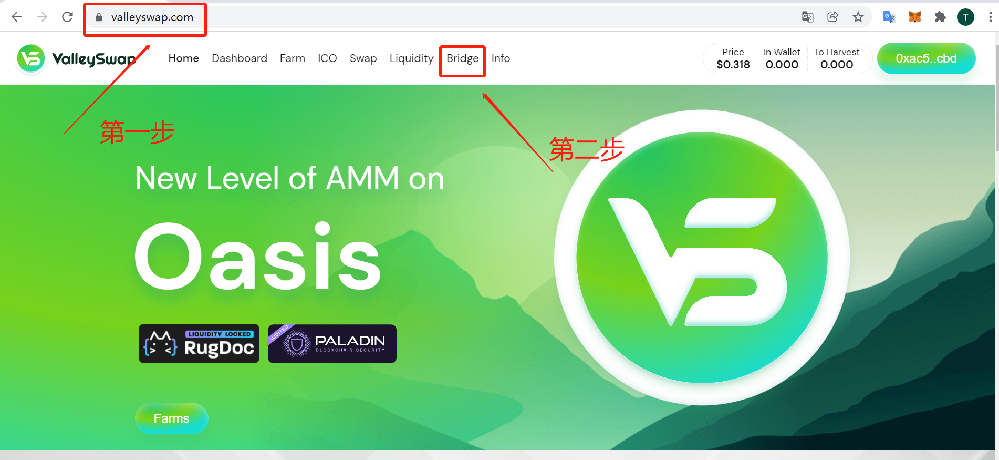
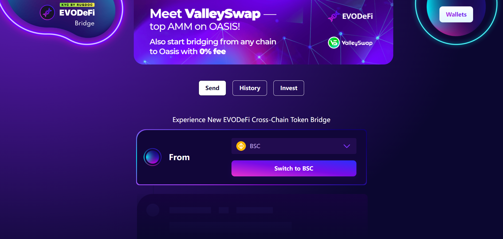
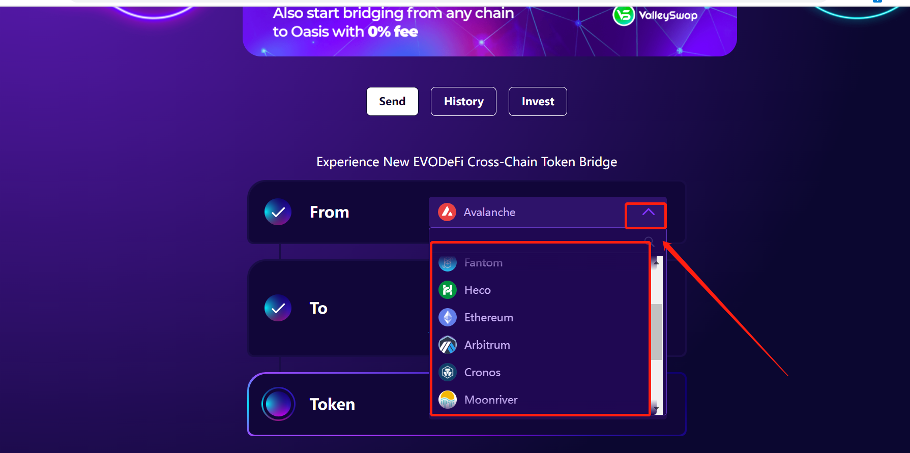
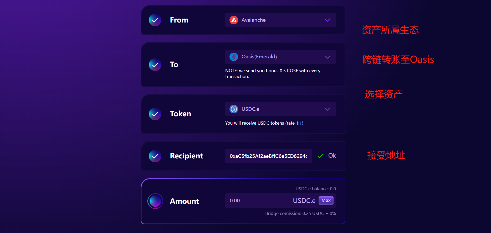

# EVODeFi简介及教程

**注意**：此跨链桥可能存在安全问题，建议慎重操作，可以优先使用其它跨链桥，如有疑问，请及时进入[官方电报群](https://t.me/oasisnetworkchina)咨询。

## 前言：
Oasis网络是一个具有隐私保护功能的区块链平台。目前，支持Wormhole Bridge、Multichain、CBridge、EVODeFi实现跨链转移部分代币。

## 一、EVODeFi简介：
EVODeFi致力于成为是下一代跨链桥，发行生态代币GENX Token和EVODeFi流动性挖矿奖励，打造跨链生态，项目部署在币安智能链（BEP-20）/Polygon网络（ERC-20）。手续费：每笔交易的0.5%。支持网络：BSC、Polygon、Cronos、Fantom、Terra、Harmony.one、Avalanche、Arbitrum、Ethereum、HECO、Moonriver、OKex、Tron、Solana、Bitcoin、Gnosis、Optimism、**Oasis**;

> 集成BTC网络将支持BTC跨链转账（比如币安的BTCB）；其他网络支持通常支持：USDC、USDT、ETH，其中的一个或多个资产

```
BSC-Oasis支持：USDC、USDT、ETH、BTCB
ETH-Oasis支持：USDC、USDT、ETH、WBTC（BTC Oasis暂未提供流动性）
Polygon-Oasis支持：USDC、USDT、WETH、WBTC
Avalanche-Oasis支持：USDC.e、USDT、WETH
```

## 二、Oasis桥币合约地址：

转账时确保将令牌添加到钱包中，否则将无法识别。您所要做的就是在您的钱包中寻找“添加代币”选项并粘贴代币地址。

```
USDC:
0x94fbfFe5698DB6f54d6Ca524DbE673a7729014Be
USDT:
0x6Cb9750a92643382e020eA9a170AbB83Df05F30B
ETH:
0xE9b38eD157429483EbF87Cf6C002cecA5fd66783
```

详细请参考EVODeFi Bridge[官网](https://docs.evodefi.com/evodefi-the-next-generation-cross-chain-bridge/evodefi-bridge/bridge-faq)


## 三、功能介绍：

1、	进入ValleySwap [官网](https://valleyswap.com/)，点击Bridge，进入EVODeFi Bridge/或者直接进入EVODeFi Bridge[官网](https://bridge.evodefi.com/)。



2、	进入EVODeFi Bridge跨链转账界面，如下图；



3、	选择对应需要移动资产所属生态，首先您需要将您的钱包连接您需要选择要移动资产的网络 - 确保您的钱包已连接到该链 - 然后单击“连接钱包”按钮。



4、	之后按照提示填写选择跨链网络、token、接受地址、token数量信息，完成之后。到Oasis网络查看对应的资产，参与Oasis生态质押挖矿、DeFi等生态红利；



## 四、其他链接：

* [EVODeFi官网](https://bridge.evodefi.com/)

* [ValleySwap官网](https://valleyswap.com/)

>作者：Jistin 2022/03/11