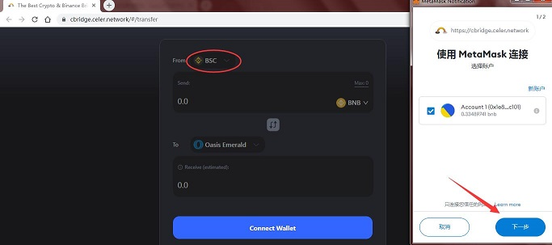
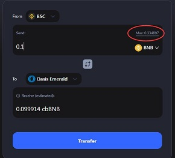
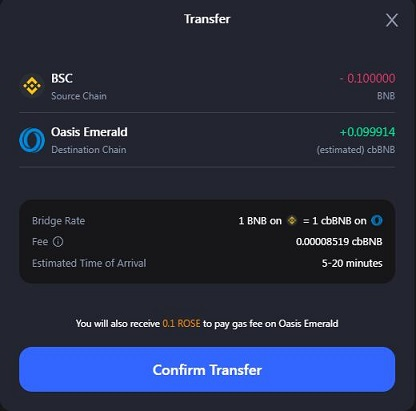
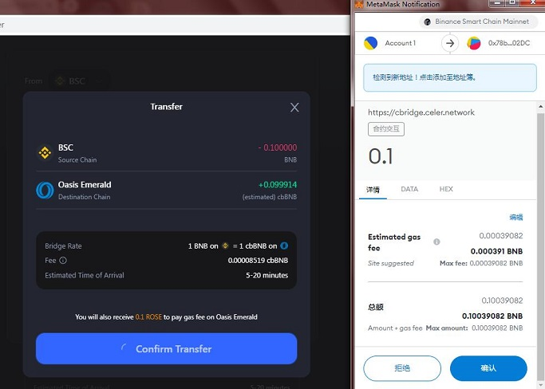
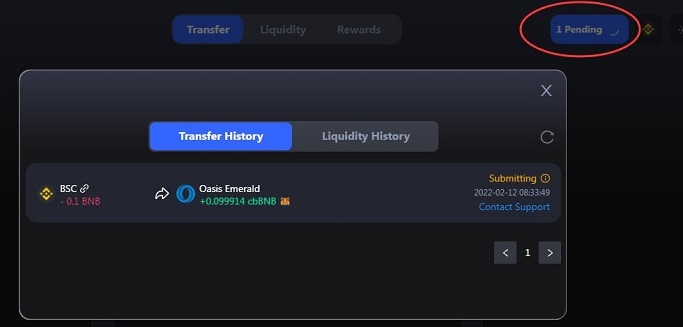
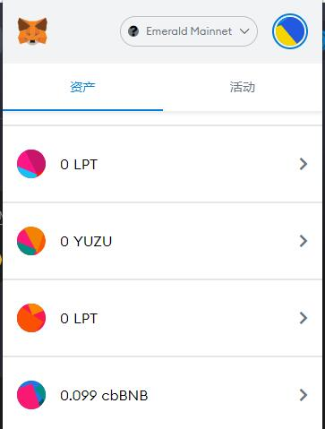

# cBridge简介及教程

Celer将cBridge集成至Emerald ParaTime，以实现更好的区块链互操作性。用户现可通过cBridge将以太坊上的USDT、USDC、WETH、DAI，BSC上的BNB、BUSD，Fantom上的FTM以及Avalanche上的AVAX快速低成本地跨链至Oasis。

Oasis网络上cBridge桥接代币的代币地址如下（在Emerald链上添加如下对应代币合约）：

代币地址详见CBridge官方文档 ：https://cbridge-analytics.celer.network/assets


```
（以太坊）
USDT：0x4Bf769b05E832FCdc9053fFFBC78Ca889aCb5E1E
USDC:0x81ECac0D6Be0550A00FF064a4f9dd2400585FE9c
ETH：0x6a2d262D56735DbA19Dd70682B39F6bE9a931D98
DAI：0x5a4Ba16C2AeB295822A95280A7c7149E87769E6A
（BSC）
BNB:0x3795C36e7D12A8c252A20C5a7B455f7c57b60283
（Avalanche）
AVAX：0x6De33698e9e9b787e09d3Bd7771ef63557E148bb
（Fantom）
FTM:0x7f27352D5F83Db87a5A3E00f4B07Cc2138D8ee52
```

本文以BSC链上的BNB代币（在Emerald上为cbBNB）、Metamask钱包为例

## 一、打开cBridge，授权钱包

打开跨链桥[cBridge](https://cbridge.celer.network/#/transfer),选择BSC转移到Emerald网络，通过钱包窗口授权



授权后，可在下图中看到当前代币的现有数量




## 二、确认转移及授权

输入想要跨链的代币数量后，点击下方“Transfer”




确认转移“Confirm Transfer”，并在钱包内确认



## 三、等待转移完成

确认转移后，将在5分钟~30分钟内完成转移，此时可以点击右上角“Pending”来查看（如果转移完成，将显示“Histroy”）



## 四、查看钱包内代币

钱包切换到Emerald网络，添加对应的代币合约地址，即可看到已转移过来的代币（此文中为cbBNB）



## 五、备注

其他跨链操作与如上相同


