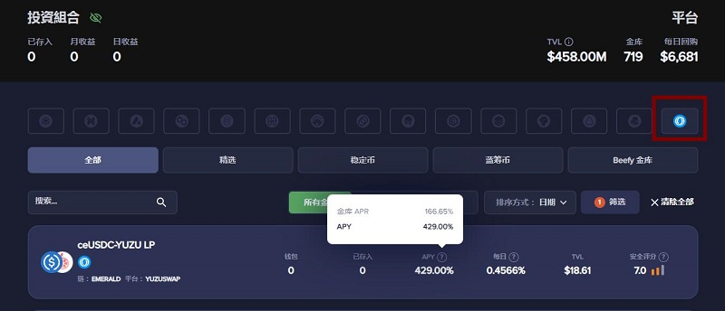
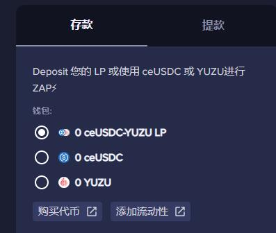
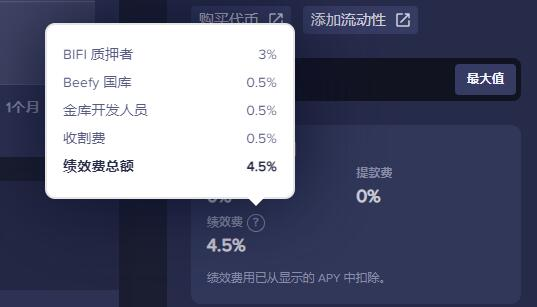

# Beefy去中心化多链收益优化平台

## 一、简介

Beefy 是一个去中心化的工作中心，且项目是匿名的（匿名团队运作）。诞生于2020年9月21日, 第一组金库于2020年10月8日开放。2022年5月14日，正式上线Oasis Emerald，并提供YuzuSwap相关的5个金库。

Beefy的特点是利用多链上的lp代币，进行自动化的复利机制，节省个人时间和交易费用。（节省收取LP质押奖励、组lp对、添加质押的操作）

Beefy提供金库、Lanuchpool、模块化智能合约的金库策略。


注意：**本文不提供投资建议，资金操作请注意风险**。以下仅以Emerald相关内容进行介绍，多链信息请参照官方文档库。

## 二、存入及提取的注意事项

打开操作界面 [https://app.beefy.com/](https://app.beefy.com/) 选择最右侧的 Oasis链,可以看到下方的5个金库。

更新:

- 2022/05/26 新增USDC-USDT LP 稳定币流动对

- 2022/06/04 新增ValleySwap的4个流动对。VS-USDT、ETH-USDT、BTC-USDT、USDC-USDT



金库显示如下信息

- 链/平台：此金库位于的区块链以及DEX平台
- APY：频繁复利的年度百分比收益率(APY)，与没有计入复利的年利率(APR)。复利的效果是呈指数式增长，而不是线性增长的。每天1%的复利，一年的收益为3678.34%。

点击进入金库详细页面，在右侧可看到详细操作



可选择存入LP代币，或者将LP流动对中的某一代币进行ZAP兑换，自动组成流动对来存入金库。

例如，选择单币YUZU进行添加：

```
为了平衡一对流动性对, X YUZU 将被换成 Y ceUSDC (可能存在±1% 滑点和存款费用)；
添加流动性以获得 ceUSDC-YUZU LP；
将收到的 ceUSDC-YUZU LP 存入 Beefy 金库；
将未使用过的微量的 ceUSDC 和 YUZU 返还到您的钱包
```
存入后，将获得 mooYuzuceUSDC-YUZU 代币（代表用户持有的金库份额）作为金库的凭证。存入时间越久，mooYuzuceUSDC-YUZU对应的提款时的ceUSDC-YUZU LP越多。（待定的奖励不会反映在余额中，直到它们被交换为初始存入的代币）

提取时，最终会收到与最初存入的相同代币，如当初存入的不是LP代币，那么提取时，Beefy会将LP兑换成存入时的代币。

接上面的例子，

存入：YUZU-->(ceUSDC-YUZU LP)-->(mooceUSDC-YUZU LP)

提取：(mooceUSDC-YUZU LP)-->(ceUSDC-YUZU LP)-->YUZU

## 三、收益

流动性池 (LP) 金库的运作方式是将授予LP参与者的费用进行再投资。作为提供流动性的奖励，许多平台使用其原生代币以奖励投资者。金库定期收集这些奖励，出售并购买更多的代币来构成流动性池代币，然后再投资它们以完成循环。

这使从流动资金池中获得的回报更加丰厚。Beefy创建的策略使这一过程自动化。所有这一切都是以很小的费用完成的，该费用会分配回 Beefy 治理池或 BIFI Maxi 金库中的质押者。 

大多数金库都有一个绩效费结构，从收获的奖励中抽取4.5%再次分配：3% 被分配回奖励池和 BIFI 质押者，0.5%被分配公款，0.5%给开发金库的策略师，0.5%给呼叫收割功能的一方。这些费用已经包含在每个金库的APY和日利率中。



## 四、BIFI代币

**注：Emerald 上暂无BIFI相关金库**

$BIFI 代币是 Beefy Finance 中“符合股息条件”的收入份额，持有者通过它赚取 Beefy Finance 产生的利润，并有权对重要的平台决策进行投票

BIFI Maxi 金库允许用户像在 RewardPool 中一样质押他们的 $BIFI，但以 $BIFI 获得他们的奖励。 通过质押他们的 $BIFI，每个参与者将他们在协议收入中的份额转换并复合成更多的 BIFI 代币。 由于不再需要铸造 BIFI 代币，这些代币是通过使用 wBNB 从公开市场购买 BIFI 来提供给质押者的。

## 五、风险

Beefy 的金库是经过审计的，但这并不意味着金库是完全没有风险的：

- 存入金库的资产没有数量减少的风险，但货币价值可能会减少。

- 与任何智能合约一样，最终风险是投资者的资金可能被盗或无法提取。

Beefy 团队采取了措施来量化智能合约的安全风险，并且只会在几度测试后与满足一组特定要求的合约进行交互，以确保底层平台不包含所谓的 “rug-pull” 功能。

## 六、其他

BIFI合约地址：[多链地址](https://docs.beefy.finance/v/cn/ecosystem/bifi-token/contract-addresses)

[官网](https://app.beefy.com/)
[文档库](https://docs.beefy.finance/)
[Telegram](https://t.me/beefyfinance)
[Discord](https://discord.com/invite/yq8wfHd)

作者：moi 2022/05/16 更新 moi 2022/06/04
