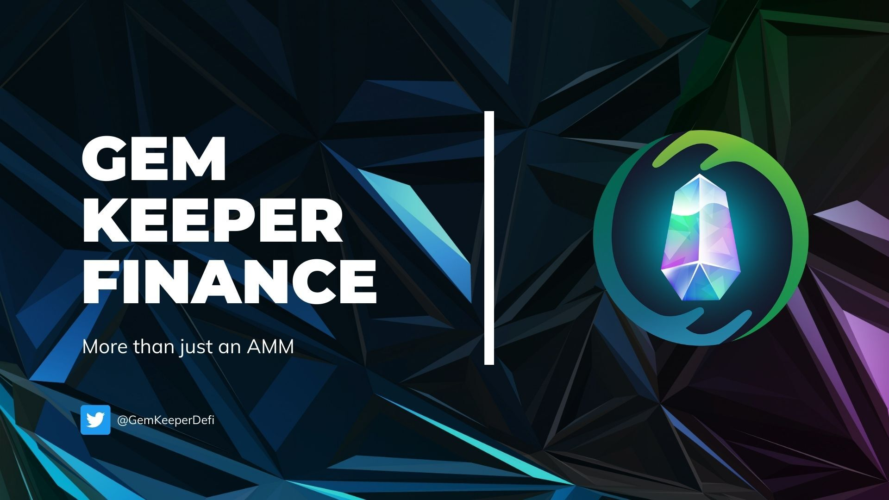

# GemKeeper介绍

**GemKeeper**是一个基于Oasis的AMM&DeFi平台。我们的愿景是建立一个一站式的平台来满足我们用户的任何DeFi需求。GemKeeper令牌BLING将是GemKeeper旗下所有产品的基石。

**GemKeeper**由PeckShield审计([报告](https://github.com/GemKeeperDEV/GemKeeperFinance/blob/main/PeckShield-Audit-Report-GemKeeper-v1.0.pdf))，由0xDiamond和Azer创立于2022年1月

GemKeeper诞生的初衷是为了解决DeFi所面临的问题，并创造一些独特和创新的东西，与绿洲网络及其社区的出现产生共鸣。

### GemKeeper功能
- Swap（交换）

在我们的游戏化平台上与我们的自动做市商(AMM)交易所进行无缝交易

- Yield Farming（收益农场）

持有LP代币进入农场，并获得$BLING作为回报

- Bridge（跨链桥）[How it Works](https://gemkeeper-finance.gitbook.io/docs/gem-keeper/bridge)

跨链桥由MultiChain、Wormhole提供支持，以下是GemKeeper中桥资产所对应的合约地址

| Token | Address |
| ----| ---- |
| USDC (Multichain) | 0x80a16016cc4a2e6a2caca8a4a498b1699ff0f844 |
| USDT (Wormhole) | 0xdC19A122e268128B5eE20366299fc7b5b199C8e3 |
| wETH (Wormhole) | 0x3223f17957Ba502cbe71401D55A0DB26E5F7c68F |
| BUSD (Multichain) | 0x639A647fbe20b6c8ac19E48E2de44ea792c62c5C |
| BNB (Multichain) | 0xe3f5a90f9cb311505cd691a46596599aa1a0ad7d |
| LINK (Multichain) | 0xbf6ABe88a1A780d17786A82c93b56941a281DB66 |
| UST (Wormhole) | 0xa1E73c01E0cF7930F5e91CB291031739FE5Ad6C2 |

- Zap

该功能提供从单币种到LP的快捷兑换

- 即将到来的新特性

我们计划在GemKeeper的旗下添加更多的产品和功能，敬请关注我们的公告~

> 作者：胜军哥 更新时间：2022/3/24