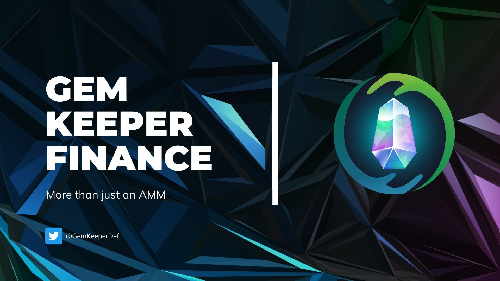

# GemKeeper挖矿

### 挖矿
这里以wROSE-USDC为例，共需要以下步骤

- 获取wROSE、USDC
- 添加wROSE-USDC流动性
- 质押wROSE-USDC LP到农场
- 收获流动性收益
- 解除wROSE-USDC LP质押
- 移除wROSE-USDC LP

#### 1.获取wROSE、USDC
我们可以通过将部分ROSE通过DEX功能转换为wROSE，再将部分ROSE转换为USDC，至于如何将ROSE存入钱包中，请参考[Oasis与Emerald之间的ROSE划转](https://dev-oasis-cn.gitbook.io/support/ji-shu-zhi-chi/oasis-yu-emerald-zhi-jian-de-rose-hua-zhuan)

#### 2.添加wROSE-USDC LP

这里点击Confirm Supply，在钱包中点击确认即可添加成功，如果执行慢可以提高gas fee进行加速

#### 3.质押wROSE-USDC LP到农场
经过上一步的添加LP，可以切换到Liquidity中看到如图所示

下面将该LP质押到农场来赚取收益，如图所示

在左侧输入框点击MAX，然后点击Deposit存入，钱包确认即可成功，同理，提取点击Withdraw

#### 4.收获流动性收益

#### 5.解除wROSE-USDC LP质押

#### 6.移除wROSE-USDC LP

首先切换到Liquidity

移除成功后会钱包会收到一定数量的wROSE和USDC

### 代币合约地址
BLING：0x72Ad551af3c884d02e864B182aD9A34EE414C36C
总量：100,000,000

### 相关社交链接
[Telegram](https://t.me/GemKeeperAnnouncements)

[Twitter](https://twitter.com/GemKeeperDeFi)

[Discord](https://discord.com/invite/Jcbj5E9Ysd)

[GemKeeper官网](https://app.gemkeeper.finance)

[GemKeeper博客](https://gemkeeperdefi.medium.com/)

[更多细节参考-英文文档](https://gemkeeper-finance.gitbook.io/docs/welcome/introduction)

> 作者：胜军哥 更新时间：2022/3/24
