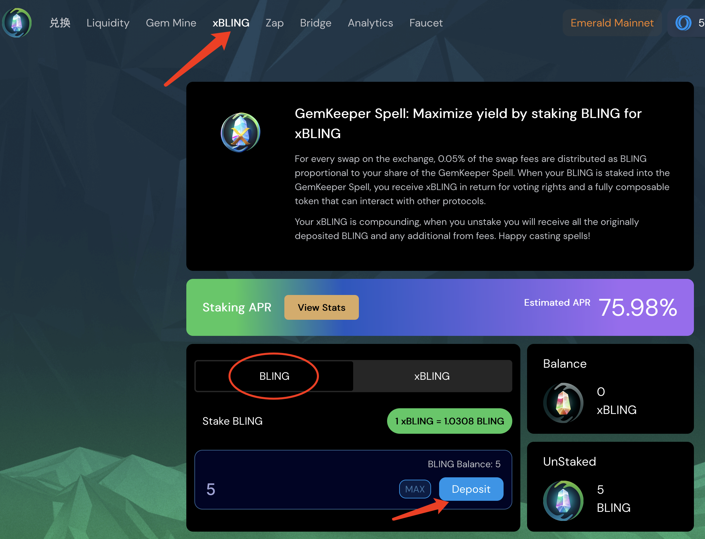
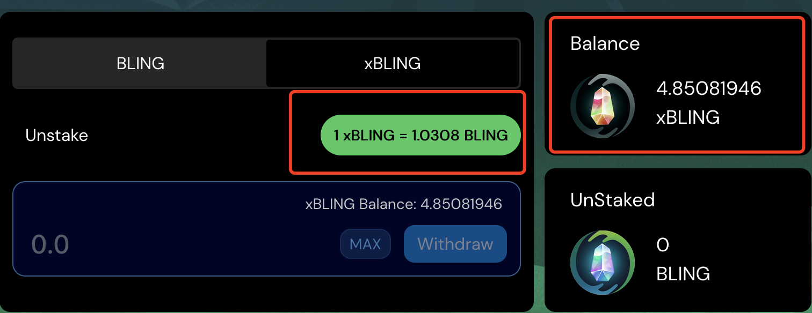

# xBLING介绍

### 题外话

> 大家好，期盼已久的 $BLING 终于可以收矿了，于4月16日凌晨开始，可以在质押界面点击 Harvest 进行收割，发行价 $0.3，由于用户的集中抛售，早上就已经砸到 $0.03，跌幅10倍，没有及时卖掉的小伙伴肯定大腿拍麻了（当然也包括作者本人 > _ <）

### GemKeeper 新功能 xBLING 单币质押介绍

对于交易所的每次交换，0.05% 的交换费用将按照 BLING 的形式分配，与您在 GemKeeper Spell 中的份额成正比，当您的 BLING 被质押到 GemKeeper Spell 中时，您将收到 xBLING 以换取投票权和可以与其他协议交互的完全可组合的代币。

计算方式如下：

> 当前流通的总 BLING 代币 = 6,000,000 $BLING
> 
> xBLING 奖励 = 0.0005
> 
> 上周交易量 = $2,252,107
> 
> 预计年交易量 = $2,252,107*52 = $117,109,564 
> 
> 投资回报率/xBLING = $117,109,564*0.0005 = 58554.78/6,000,000 ≈ 0.0097
>
> 每个 xBLING 每年获得约 0.01$ 的交易费用
> 
>
> [参考链接](https://gemkeeperdefi.medium.com/new-chapter-gemkeeper-finance-bf1185c4f18b)

### BLING 质押

首先你得有BLING，通过兑换，或者质押LP获得

图一

图二

图二所示，刚刚我质押了5个BLING，这里只收到 4.85 个xBLING，这是因为撰写本文时 1 xBLING = 1.0308 BLING ***（发布当天是1:1 的比例）***，随着质押时间越久，1 个xBLING将能兑换更多的 BLING 。在撰写文章的前一天apr能达到1000%，目前下降了很多；

### 解释
对于交易所的每次交换，0.05% 的交换费用将按照 BLING 的形式分配，与您在 GemKeeper Spell 中的份额成正比。当您的 BLING 被质押到 GemKeeper Spell 中时，您将收到 xBLING 以换取投票权和可以与其他协议交互的完全可组合的代币。
xBLING 会每一天复利一次，所以当您质押时不会立刻看到收益；

当您取消质押时，将按照当日 xBLING 兑 BLING的比例收到对应数量的 BLING。

^_^ ^_^

> 作者：胜军哥 更新时间：2022/4/18