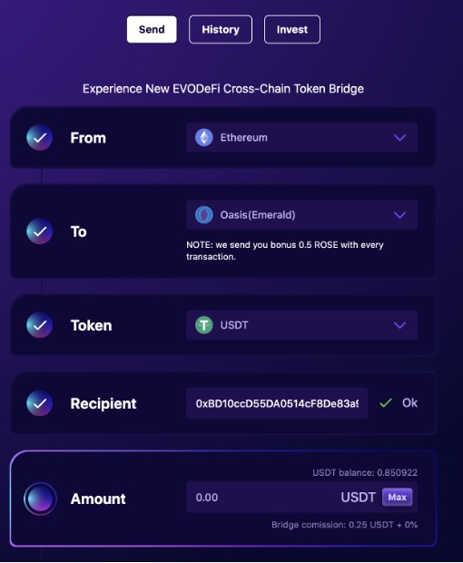

# ValleySwap-去中心化交易所

**ValleySwap**是基于Oasis的EVM兼容ParaTime Emerald构建的去中心化交易所，包括流动性挖矿、swap和IFO等功能。**ValleySwap**交易遵循的是一种非保管的、对等的、自动化的做市商模式，目标是提供快速，安全和廉价的服务。

通过与EVODeFi bridge的合作，Oasis网络上的DeFi用户和开发者可以在诸如Avalanche、BSC、Ethereum、Polygon、Fantom等各大去中心化网络之间实现资产的自由流通。	

**ValleySwap**由Rugdoc团队审计([报告](https://rugdoc.io/project/valley-swap/))，并于2022年2月17号23:30上线Emerald。

***

## 操作指南
- 存入资产
- 合成ROSE-USDT LP令牌
- 质押ROSE-USDT LP令牌
- 收获流动性收益

### 一、存入资产
#### 1、准备代币
代币可以为ROSE(由主网转入Emerald，或者通过ValleySwap交易获得、ETH\USDT\USDC(EVODefi跨链桥转入))，需注意保持一定数量的ROSE作为Gas。

#### 2. 连接Matemask钱包
添加Emerald RPC

```
Network Name: Emerald Mainnet
RPC URL: https://emerald.oasis.dev
Chain ID: 42262
Symbol: ROSE
```

在ValleySwap[官网](https://valleyswap.com/)右上角连接钱包。

#### 3.通过EVODefi跨链桥转入资产
EVODefi连接Metamask钱包,From选择Ethereum,To选择Oasis,Token选择USDT,然后按照步骤往下即可,确保以太坊账户中有足够的ETH支付Gas费用

可参考教程[EVODeFi简介及教程](ecosystem_paticipate/bridge/EVODeFi/EVODeFi简介及教程.md)





### 二、合成ROSE-USDT LP令牌

#### 1.选择ROSE-USDT交易对授权
打开Valley Swap,连接Metamask钱包,选择Farm，授权ROSE-USDT交易对


#### 2.添加流动性

点击Add Liquidity添加流动性


#### 3.合成令牌

输入对应的ROSE和USDT后选择Supply，成功后会获得LP令牌


### 三、质押ROSE-USDT LP令牌

#### 1.质押令牌
质押令牌,质押完成后则开始获得LP池收益


#### 2.收获奖励矿币

点击Havest，收获当前矿币资产存入钱包


### 四、解除质押ROSE-USDT LP令牌

#### 1.解除质押
点击Unstake，解除当前质押


#### 2.Remove流动性

在Liquidity界面，Remove流动性即可


***

## 其他信息
### 五、即将上线
- LaunchPad功能（[申请地址](https://forms.gle/jjQdfdAtodt4UFyz6)）
- 矿币燃烧计划

### 六、代币合约地址
矿币VS：0xBC033203796CC2C8C543a5aAe93a9a643320433D

### 七、相关社交链接
[Telegram](https://t.me/valleyswapchat)

[Twitter](https://twitter.com/ValleySwap)

[Discord](https://discord.com/invite/bChB2Vs9SU)

[ValleySwap官网](https://valleyswap.com/)

作者：Reno 最新编辑：2022/3/10
