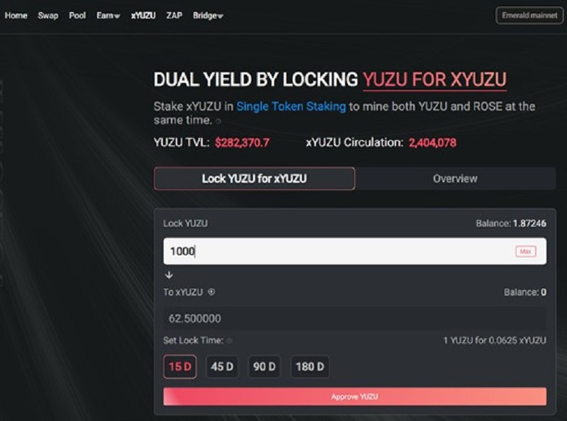
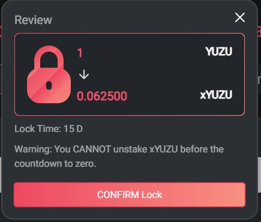
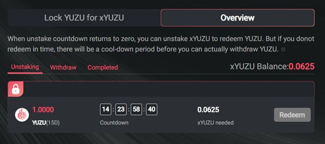
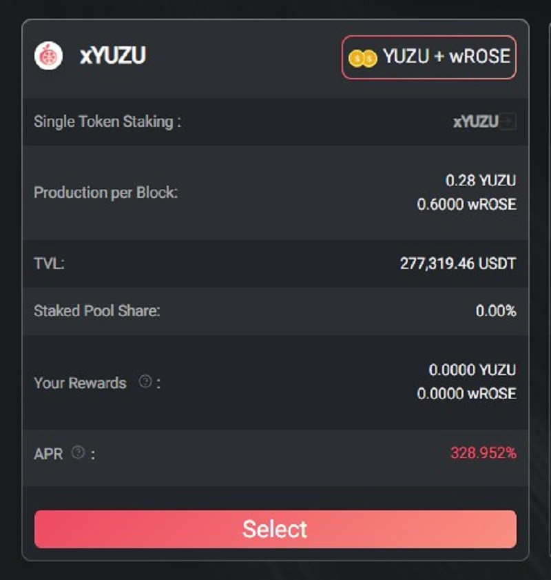

# xYUZU介绍及注意事项

2022/04/09 YuzuSwap新上线xYUZU代币，及对应的新的矿池。

抵押锁定YUZU代币来获得xYUZU，将xYUZU单币质押，从而获得YUZU+wROSE双币收益.

## 一、锁定YUZU获得xYUZU

进入 [YuzuSwap](https://app.yuzu-swap.com/),链接钱包。从顶部菜单**xYUZU**进入,选择**Lock YUZU for xYUZU**标签页，输入YUZU数量、锁定周期，并点击底部**LOCK**按钮

如图，不同的锁定时间，换取的xYUZU数量有较大差异。

确认兑换（本文以1YUZU为例）

兑换完成后，可以切换到**Overview**标签页，查看已锁定的资金代币情况

注意事项：

- 1、不同的锁定周期，兑换的xYUZU数量不同。周期越长，xYUZU数量相对越多
- 2、当锁定到期时，需要与当初兑换出的同等数量的xYUZU来解锁YUZU。如：1000YUZU锁定15天，获得62.5xYUZU，那15天后，需要归还62.5xYUZU来解锁1000YUZU
- 3、流程为 Lock(锁定）-->利用xYUZU挖矿获得收益-->到期后Redeem（解锁）-->Wtihdraw（提取）
- 4、当到期后没有及时归还xYUZU来解锁，将会导致延期解锁。比如90天到期，在第100天（超期10天）开始才解锁，那么将在第110天才可以提取出解锁成功的YUZU（延期最长不会超过锁定的时长，本例中为90天）

## 二、xYUZU单币挖矿

如下图，切换到顶部菜单**Earn**-->**Liquidity Mining**，可以看到xYUZU的单币矿池。

YuzuSwap操作教程请参照[Yuzuswap操作教程|Oasis生态首个Dex上线，赢取丰富奖励
](https://medium.com/@OasisNetworkCN/yuzuswap%E6%93%8D%E4%BD%9C%E6%95%99%E7%A8%8B-oasis%E7%94%9F%E6%80%81%E9%A6%96%E4%B8%AAdex%E4%B8%8A%E7%BA%BF-%E8%B5%A2%E5%8F%96%E4%B8%B0%E5%AF%8C%E5%A5%96%E5%8A%B1-9cb5fbbfe112)

最后提醒：请做好时间规划，及时从矿池中提取足量的xYUZU来解锁即将到期的YUZU，避免延期从而导致资金流动性问题。

> 作者：moi 2022/04/11 最后编辑：moi 2022/04/11