# MetaMirror

目录

- [一、简介](#yi-jian-jie)
- [二、首页介绍](#er-shou-ye-jie-shao)
- [三、查看 NFT](#san-cha-kan-nft)
- [四、交易 NFT](#si-jiao-yi-nft)
- [五、Mlaunch](#wu-mlaunch)

## 一、简介

MetaMirror为Oasis Emerald上首个NFT市场。2021年12月15日，宣布推出AI ROSE系列NFT。作为基于Oasis网络构建的第一个NFT系列，AI ROSE NFT由999张AI生成的玫瑰图像组成。后续已上架10几种NFT。

作为生态NFT市场，MetaMirror此前已经推出MetaMirror Gallery交易平台和Web 3.0+ 去中心化身份服务MBuddy。结合MLaunch功能，MetaMirror将筑牢Web2与Web3沟通桥梁，进一步拓展社区规模及影响力，成长为Oasis生态第一个成熟的NFT市场。

2022/06/17 MetaMirror v2已正式上线 [gallery.metamirror.space](https://gallery.metamirror.space/)

## 二、首页介绍

打开  [gallery.metamirror.space](https://gallery.metamirror.space/)，点击右上角链接钱包。
> Emerald 钱包相关的内容请参照[Oasis与Emerald之间的ROSE划转](/dev_support/Oasis与Emerald之间的ROSE划转/Oasis与Emerald之间的ROSE划转.md)

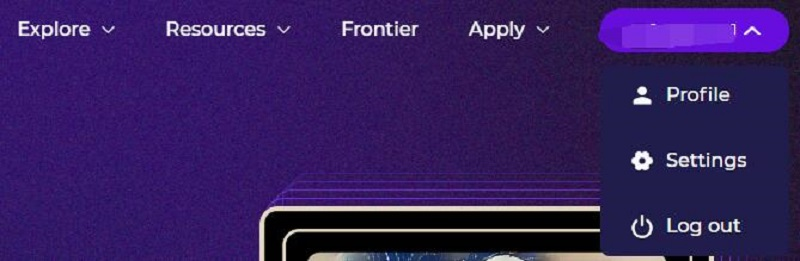

- Explore 显示NFT相关
    - Collection：分类显示所有NFT
    - Rankings：显示NFT的流行排名
- Resources 显示官方的资源列表。如媒体、帮助中心、教程、旧版界面(V1，已废弃)
- frontier 前沿。MetaMirror 画廊的前沿，支持创新和最前沿的区块链技术。当前显示的是 Emerald 上第一个利用 Parcel 技术的加密 NFT “Army of Minions”
- Apply 申请。用户可以自行制作 NFT 并申请发布

**右上角钱包**处点击，可以看到3个按钮

- Settings 设置界面。可以设置用户的昵称、电子邮件等，以及关于交易的及时提醒设置（通过邮件发送）。

- Profile 进入个人收藏界面

如下图，可以看到个人的 NFT 状态、挂单、报价等活动。

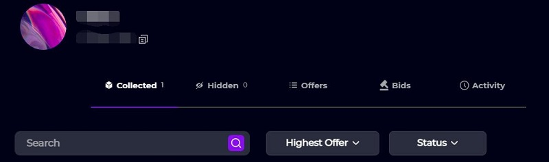

## 三、查看 NFT

打开 Explore - Collections 菜单。

左侧可以筛选 NFT 的分类，“前沿”“艺术”等，右侧可以根据“交易量”“最近”来进行排序。

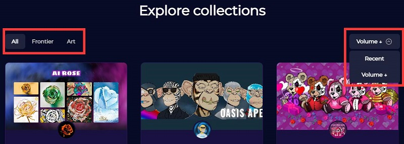

点击 NFT 集合进入（本文以 AI ROSE 为例）

首先可以看到 NFT 的基本情况，如

总发行数量、拥有者数量、地板价、成交量、制作者版税

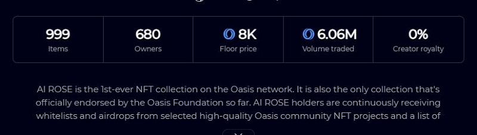

下方分为两个标签页：

**Items** 展示本集合中的所有 NFT，同样可以进行筛选。
- Newest：ID、稀有度、价格、历史最高交易价、历史最高报价等。
- Status：可直接交易、拍卖中、报价中

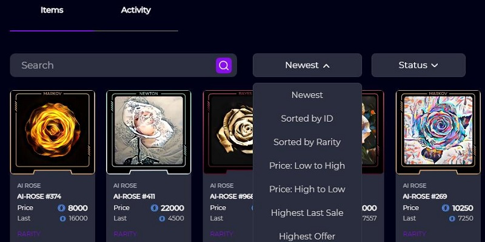

**Activity** 标签页展示最近的交易记录

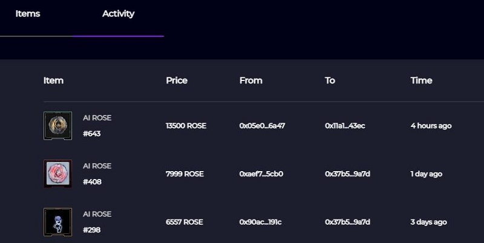

## 四、交易 NFT

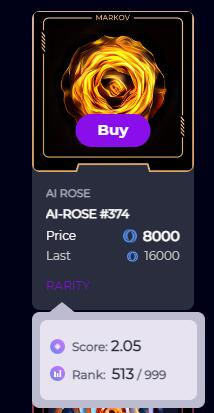

点击 **PARITY** 可以查看 NFT 的稀有度、评分等其他属性。

### 快速购买
鼠标指向 NFT 时，会出现 **buy** 按钮。点击此按钮可以进入快速交易模式。可以直接完成 NFT 的购买

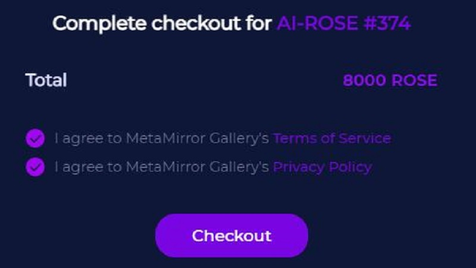

### 正式购买
点击其他区域，进入 NFT 正式交易界面

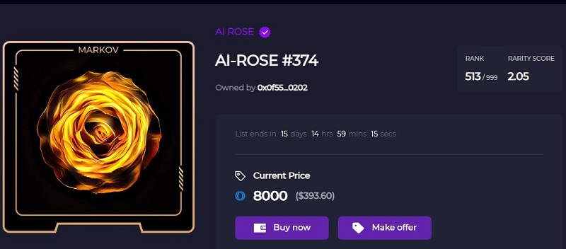

如上图，除了可以直接购买 **Buy now**,还可以主动提供报价 **Make offer**.当拥有者同意时即可完成交易。

### 出售

在右上角 Profile 中，可以查看当前拥有的 NFT 状态，以及购买意向、拍卖等。（图片见第二节）

在此点开拥有的 NFT 可以
- Send 转移 NFT （直接转移到另一个地址，此处不再演示）
- Sell 销售 NFT

进入 **Sell** 界面，可以直接挂单销售，也可以采用拍卖模式
挂单模式：填写价格、过期时间。（成交时，平台收取2.5%的税）

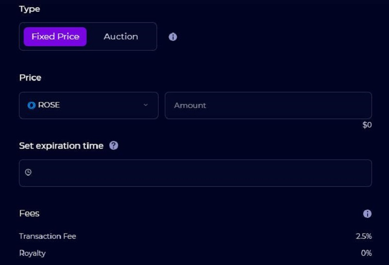

拍卖模式：填写起拍价、过期时间、每次加价涨幅、一口价（可选），税同上。

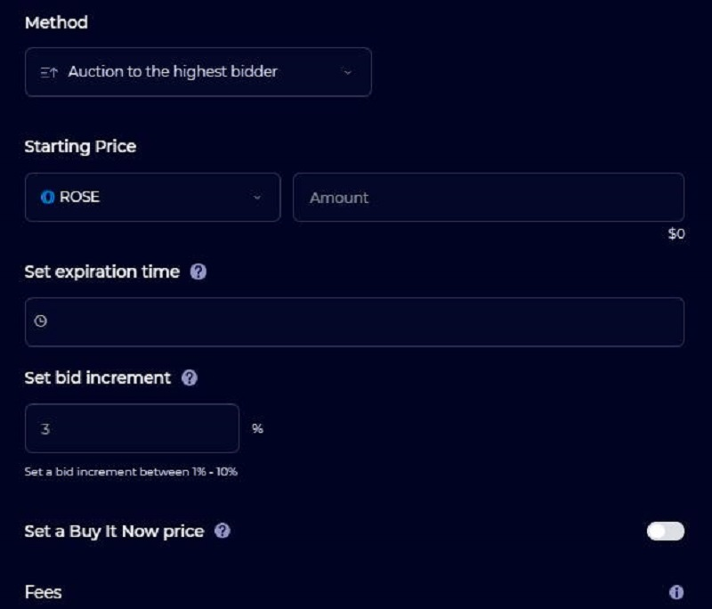

## 五、MLaunch

登陆 [https://gallery.metamirror.space/mlaunch/](https://gallery.metamirror.space/mlaunch/) 点击右上角Apply进入[mlaunchform](https://gallery.metamirror.space/mlaunchform/)。依据页面指引一步步操作并提交。

MLaunch是建立在 MetaMirror 之上的新发射台（Launchpad），通过提供一系列简单实用的功能，MLaunch旨在帮助艺术家拥抱NFT技术：

无代码铸造服务:

一般情况下，铸造NFT、举办NFT发售活动又或者是白名单生成，都要求创作NFT的艺术家们具备一定的技术编码能力，这在无形中提高了NFT进入门槛。使用 MLaunch，艺术家只需点击几下鼠标，即可构建他们的NFT智能合约并设置发布活动。

自动化的社区参与

艺术家们需要为他们的艺术作品建立一个具有一定规模的活跃社区，而这要求艺术家们付出诸多努力。而MLaunch作为MetaMirror项目的一部分，MetaMirror拥有的庞大用户社区将赋能NFT项目的初期发展，艺术家们可以获得更多真实有用的数据，帮助他们观察社区调整策略。另外，艺术家还可以创建自己的MBuddy空间，管理转发、邀请、签到、聊天和其他任务，发展自己的社区。

将Web2粉丝引入Web3

MLaunch能够帮助艺术家的粉丝，完成从Web2到Web3的身份过渡转变，这使得艺术家可以通过MBuddy与他们粉丝的镜像身份进行互动。

> 最后编辑：moi 2022/06/09 因MetaMirror发布V2版本，重构全文。