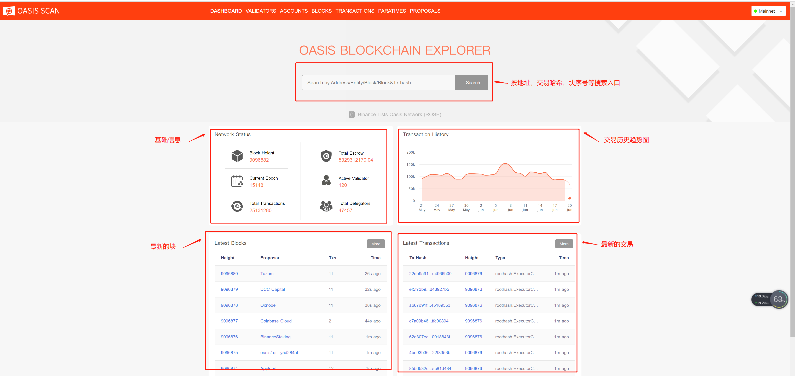
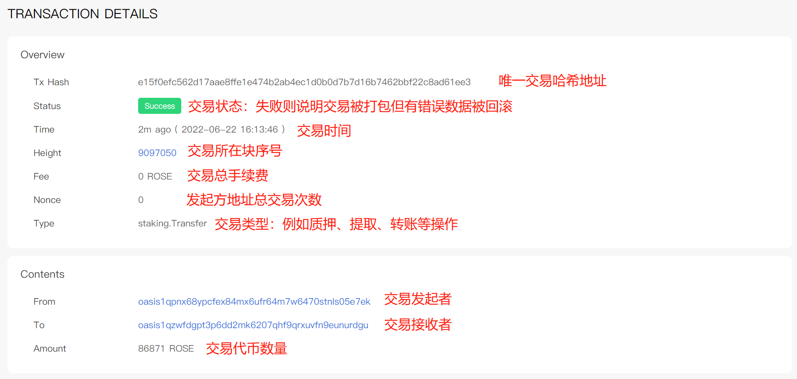
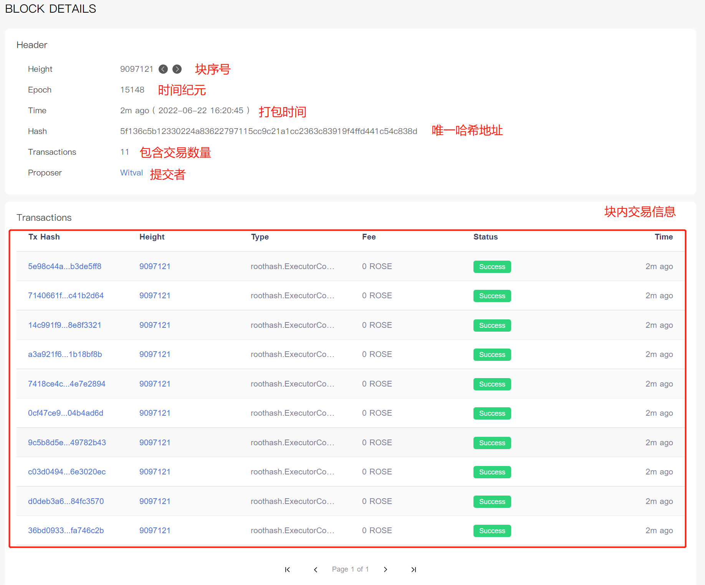
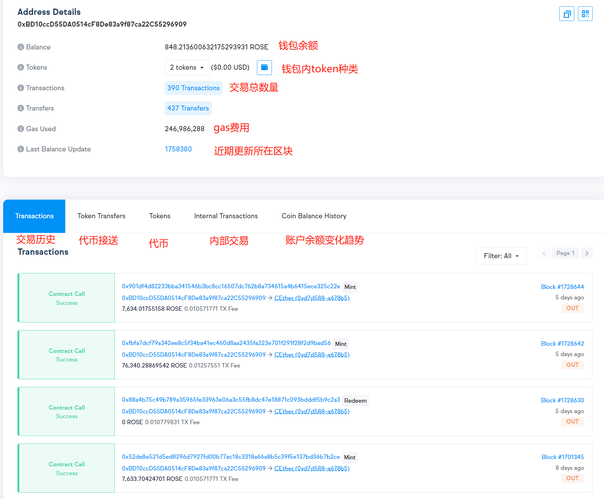
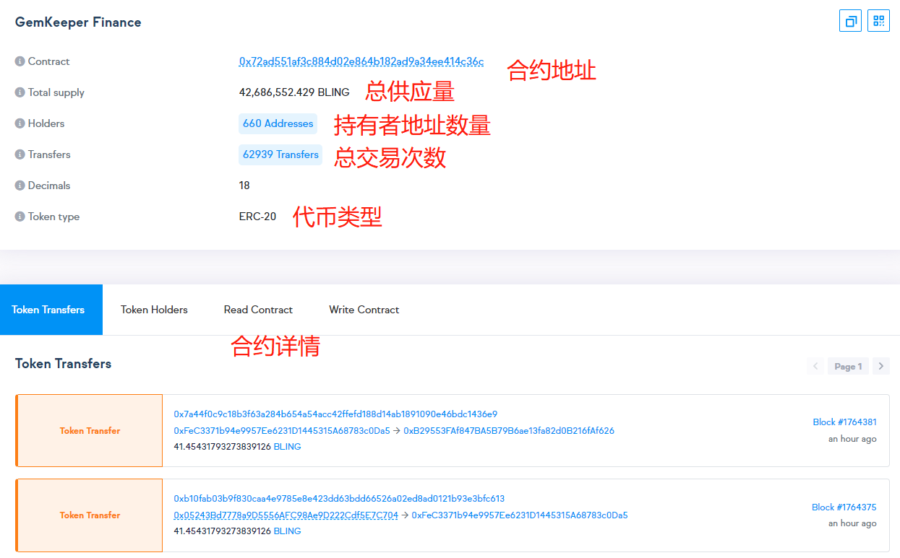

# 区块链浏览器

## 一、区块链浏览器链接
Oasis区块链浏览器：https://www.oasisscan.com/
Emerald 链上浏览器：https://explorer.emerald.oasis.dev/

## 二、区块链浏览器能做什么？

可用于查看Oasis区块链中的交易公开数据、与智能合约交互以及查看地址等。Oasis中一切交互均公开，使用交易哈希（交易ID）即可查看一切相关活动，包含代币、智能合约以及钱包地址。

## 三、区块链浏览器都有什么？

所谓区块链是将若干笔交易执行后打包成块，发布并记录账本的技术，所谓合约是交易中利用备注区域携带了定制的代码，从而在虚拟机中执行代码逻辑。只要记录下每笔交易的原始信息，就可以逐个回放从而还原全部过程。

这这涉及到公共信息的三个部分：交易，区块，地址。也就是下图中3个区域

而中间夹着的就是最常用的基本信息：
- Block Height:当前的区块高度
- Total Escrow:总托管量
- Current Epoch:当前纪元
- Active Validator:当前活跃验证者
- Total Transactions：总交易量
- Total Delegators：委托人总数

 
## 四、交易详情信息

任意选择一个最新的交易点进去，大多数数据都是一目了然的。

就像一个快递的整个生命周期：

- 快递单号是多少（Transaction Hash）
- 投递是否成功（Status）
- 对方什么时候收到（Timestamp）
- 从哪儿来from，到哪儿去to
- 被哪个快递员打包（Block）
- 信封内有什么（Amount)
- 邮费是多少（Transaction Fee）
- 邮递方式（Type）

 

## 五、块详情信息
块的信息，相对复杂其实对状态分析意义不大。以下仅列出常用的几种操作
- staking.Allow 允许使帐户持有人成为受益人
- staking.Withdraw 受益人能够从给定的帐户中提取收益
- staking.AddEscrow 添加质押
- staking.ReclaimEscrow 提取质押
- staking.Transfer 转账
- staking.Burn 燃烧

 
## 六、地址详情信息

注意，这里的信息源自链上，但实际是由Oasis区块链浏览器二次整理而得。

个人地址信息：

如果你在好奇自己地址累计的各种ERC20代币如何找到，就可以从Token列表内查阅。

可以使用此功能监控某大户地址其余额的变动，关注某行业KOL新买了什么NFT，参与了哪些Defi产品等等信息。
 

如果此地址是合约的话，还能看到有个contract栏目

合约地址信息：

可以利用此功能，监控某合约近期交易量，体现其背后产品热度的最基础指标。

如果合约已完成验证开源，则可以直接查阅代码，这里不做过多展开。
 

