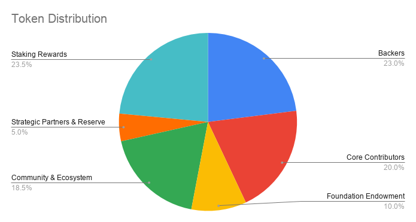
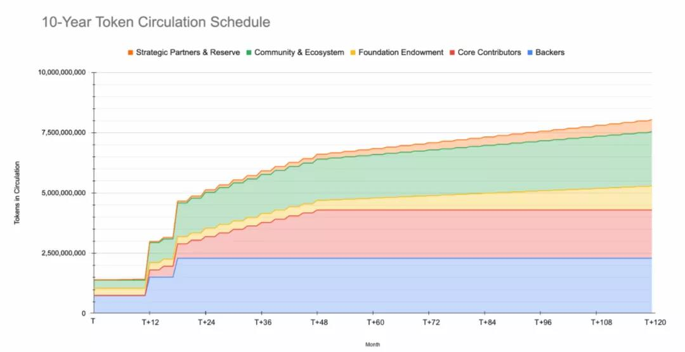
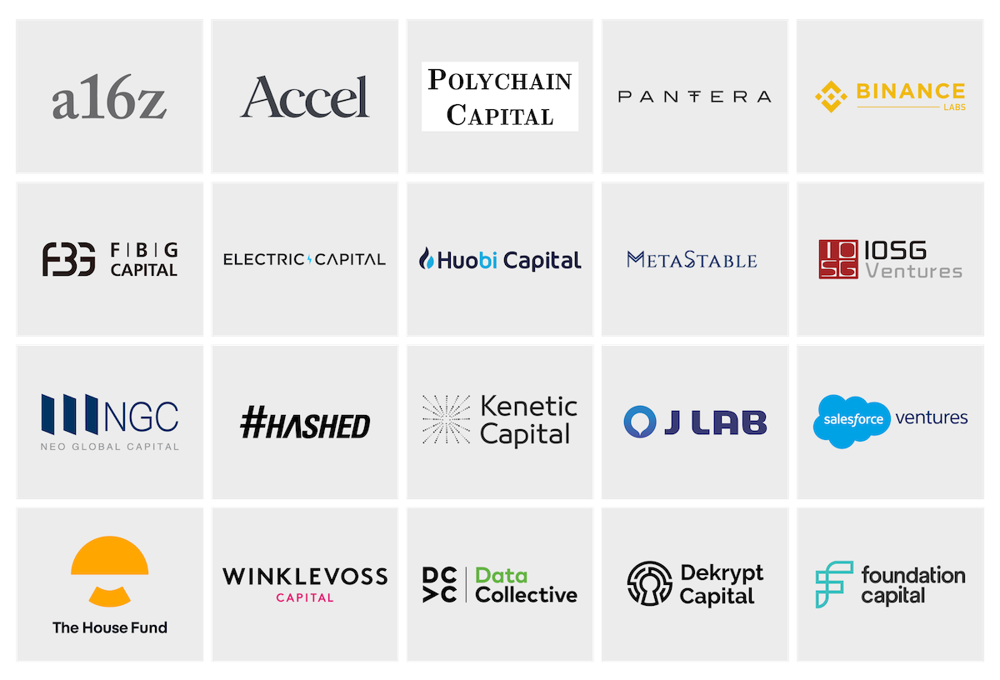
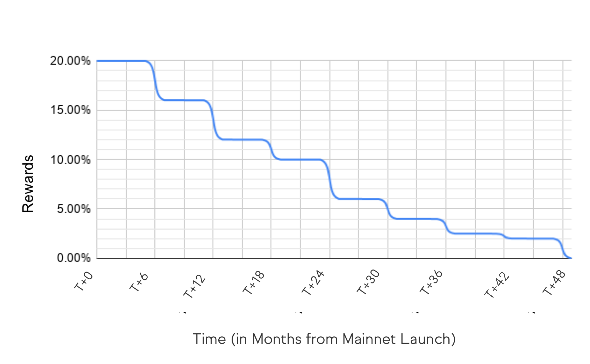

# 代币分配

## 代币情况速览
供应：ROSE原生代币是受限供应的代币。发布时的流通供应量约为15亿代币，总上限固定为100亿代币。

代币使用：ROSE 代币将用于共识层的交易费用、质押和委托。

质押奖励：约23亿代币将作为赌注奖励自动支付给确保网络安全的质押者和授权者。

## 代币分布

### 
为各种网络功能保留的ROSE代币数量占现有代币供应总量的百分比大致如下。(请注意，这些百分比和分配可能会在我们最终确定网络及其相关计划的逻辑时发生变化。
)

|Name|名称|占比|
|:---: |:---: |:---: |
|Core Contributors|核心贡献者|20%|
|Community & Ecosystem|社区和生态系统|18.5%|
|Foundation Endownent |基金会|10%|
|Backers|支持者|23.5%|
|Staking奖励|质押奖励|23%|
|Strategic Partners & Reserve|战略合作伙伴和储备金|5%|

### 代币分布展示

支持者：在mainnet发布之前直接出售给支持者的代币。这些销售绝大多数发生在2018年。

核心贡献者：为绿洲网络的发展做出贡献的核心贡献者的报酬。

基金会捐赠：向绿洲基金会捐赠资金，以促进绿洲网络的发展和维护。

社区和生态系统：为参与绿洲网络社区的项目和服务提供资金，包括开发者赠款和绿洲基金会的其他社区激励措施。

战略合作伙伴和储备：为绿洲网络中的关键战略合作伙伴提供的项目和服务提供资金。

质押奖励：为绿洲网络的安全做出贡献的staker和授权人将在链上获得奖励。

查看当前代币详情，可使用[Oasis区块链浏览器](https://www.oasisscan.com/)，或[Oasis oasismonitor](https://oasismonitor.com/)

### 循环供给

并非所有代币都已公开发行或将由Mainnet launch公开发行。由于发布时间表和锁定机制，在Mainnet运行时，现有代币供应总量中只有一小部分将处于流通状态。固定供应的100亿代币中，大约有15亿代币将在Mainnet上立即流通。此外，发行时不在流通供应范围内的一部分基金代币会被质押在网络上。任何赢得的质押奖励都将通过未来的验证授权、网络功能开发和生态系统拨款返回网络。

预留用于质押奖励的代币将按照链上奖励机制进行支付，该机制根据验证人提出的区块数量、验证人签署的区块数量、参与质押的节点数量以及质押的代币数量等计算奖励。剩余分配将根据以下发布计划进行支付：

剩余的分配将根据以下发布时间表进行分配：

## 筹款历史

在2018到2020之间，Oasis已经从支持者那里筹集了45,000,000美金，包括：

## 质押激励
鉴于绿洲网络的创始愿景是成为世界级、公共、无许可的区块链平台，绿洲的贡献团队一直致力于确保为所有社区成员建立一个尽可能无缝的节点。为此，我们花了很多心思来确保我们的质押条件将进入壁垒降至最低，并鼓励在网络上进行有意义的参与。一些关键参数包括：
- 参加共识委员会（并获得质押奖励）的验证人数量：120人。验证人将基于网络上的质押权重来选择。
- 最低质押：每个实体100个代币
- 共识委员会的选择：每个实体一次最多只能有一个节点被选入共识委员会。
- 质押奖励：该网络旨在奖励质押者，奖励范围为2.0%至20.0%，具体取决于在网络上提供质押服务的时间长度。为了有资格获得每个epoch的质押奖励，节点需要在该epoch中至少签署75%的区块。
- 删减：在Mainnet启动时，网络只会删减双重签名的形式。网络将削减最低质押金额（100个代币）并冻结节点。冻结节点是一种预防措施，以防止节点受到过度惩罚。该网络在发布时不会大幅削减活跃度或正常运行时间。
解除绑定期：网络将有约14天的解除绑定期。在此期间，质押的代币有因双重签名而被砍掉的风险，并且在此期间不会累积奖励。
- 共识投票权：目前的投票机制是stake加权的。这意味着验证者的共识投票权与其stake成正比。在这种模式下，网络需要代表委员会总stake+2/3的验证者签名才能签署区块。请注意，在Tendermint中，验证人在循环分组提议人顺序中提议分组的机会也与其投票权成正比。

## 授权政策
绿洲协议基金会致力于向参与各种激励网络的实体授权。
想获得更多细节，可以阅读 Delegation Policy。

## 日志更新
- Apr 28, 2022:
    - 在绿洲网络在2022-04-11升级中将验证者更新到了120个。
- Nov 10, 2021:
    - 在绿洲网络在2021-08-31的升级中将验证者更新到了110个。
    - 在谈论绿洲网络的循环供应部分增加了循环供应标题
- April 30, 2021:
    - 在绿洲网络在Cobalt升级中将验证者更新到了100个。
- Jan 15, 2021:
    - 增加了基金的授权政策部分。
- Nov 15, 2020:
    - 将最初的验证人共识委员会修改为80个验证人。这反映了当前社区批准的genesis文件和社区建议升级到Mainnet的内容。
- Nov 2, 2020:
    - 更新了支持者形象，以展示更多公开的支持者。
    - 根据社区的提议（和基金会的支持），在绿洲网络的前四年将质押奖励从15%-2%增加到20%-2%。相关图表（分发、代币交付时间表和预期质押奖励）也进行了更新，以反质押奖励的增加。

> 2022/07/05 本文翻译自[官方技术文档](https://docs.oasis.dev/oasis-network-primer/token-metrics-and-distribution/),添加部分细节补充
