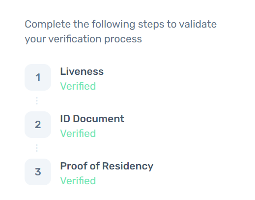

# Oasis KYC 教程

## 一、背景

随着Oasis社区生态进一步繁荣发展，各项活动异彩纷呈，很多用户也通过参与我们各种类型的黑客松、大使计划、社区传播等活动获得了ROSE代币奖励。
根据合规性要求，获得ROSE代币之前，用户必须完成KYC认证。

## 二、注册账号

1、**Oasis KYC认证入口**: [https://oasis-network-individual.synaps.io/login?returnUrl=%2F](https://oasis-network-individual.synaps.io/login?returnUrl=%2F)&#x20;

2、点击 **Create your free account** 按钮进行注册
   

3、输入您的名(FIRSTNAME)和姓(LASTNAME)、以及邮箱，点击 **Create** 按钮创建账号，稍后您的邮箱会收到验证码

4、填入邮箱验证码，点击 **Confirm** 即完成注册和登录

5、登录成功后，需等待后台同意才能进入KYC认证，该过程大约需要1-2天

## 三、认证过程

> 此过程分为三个步骤，分别是：人脸认证、身份认证、居住认证
>
> 注意：人脸认证请在移动端操作，否则可能无法使用摄像头。如果显示 **pending** 就说明需要等待人工审核，耐心等待即可。

1、人脸认证

   - 按要求操作即可

2、身份认证

   - 即上传能证明您身份的证件，护照、身份证均可，以身份证为例：

     选择 **中国**，然后选择 **\[National ID]**，上传清晰的身份证正反面照片，然后等待管理员审核即可

   > 上传的时候注意正面和反面，Front side为正面(即人像面)，Back side为反面

3、居住认证
   - 居住认证需要您上传您的居住、消费或金融方面信息，可以上传消费账单、银行账单、网约车发票(开票时备注姓名、住址)，电商发票(开票时备注姓名、住址),水电费单据

   - 核心点：

      a. 包含姓名和住址的个人信息

      b. 账单需要在三个月内，逾期则不予通过
      
      c. 选对账单分类，电费：electricity bill；水费：water bill；电商或网约车发票(推荐)：internet bill；银行：bank bill

## 四、完成认证

- 当三个步骤都显示为 **Verified** 即表示KYC

## 五、常见问题

1、第一二步不会有多么大的问题，无非就是身份证正反面提交错误，以及人脸认证的光线照射角度导致认证过程中出现的一些问题，具体一些细节文章里有提到。

2.第三步：认证用户需提供购物发票（这里建议京东自营店），可以自己申请开票，既方便也高效率，如果没有可以在商家官方自营店（例如：黑人牙膏自营店）购买商品，然后直接确认收货当天可以开到发票。【开票教程文章里有提到】

3.Oasis KYC认证官网添加了一些新的内容：用户在认证过程中需提供地址证明

- 地址（第一栏）：填写与发票中相同的地址
- 省份及邮编：xx省xx市，邮编百度查询（具体到区/县）

4.KYC认证过程中需要使用到的工具：WPS编辑（修改发票用）

5.鉴于不同省份（直辖市/县城/村庄）不同地址都会有不同的住址证明方式，在第三步住址证明认证中会出现不同原因而导致的失败， 

## 参考
* [Oasis: 一图搞定KYC | 三步申领你的 ROSE 奖励！](https://mp.weixin.qq.com/s/zGXMgi_yB5_mo-uRnoW8yQ)
* [知乎: 如何快速通过Oasis的kyc？](https://www.zhihu.com/question/464082940)

> 作者: evan 2022/03/26 最新编辑: White 2022/03/27
