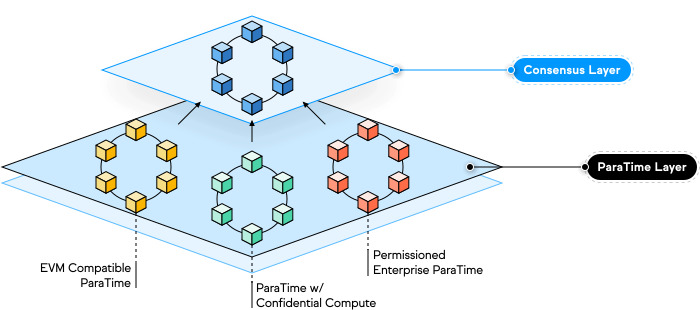

# Oasis网络概览

Oasis 网络是去中心化的区块链 Layer 1 网络，旨在设计拥有独特的可扩展性、隐私优先和多功能性。

该网络有两个主要的架构组件，共识层和ParaTime层。
- 共识层由一组去中心化的验证节点来运行具有可扩展、高吞吐量、安全、基于权益证明（Proof-of-Stake）的共识。
- ParaTime层托管许多并行运行态（ParaTimes），每个运行态代表一个计算环境的拷贝，各计算环境之间共享状态。

## 技术亮点
- 将共识和执行分为两层 —— 共识层和ParaTime层 —— 以实现更好的可扩展性和多功能性。
- 共识和执行的分离允许多个 ParaTime 并行处理事务，这意味着在一个 ParaTime 上处理的复杂工作负载不会减慢另一个更快、更简单的事务的处理。
- ParaTime 层是完全去中心化的，允许任何人开发和构建自己的 ParaTime。每个 ParaTime 都可以单独开发，以满足特定应用程序的需求，例如隐私计算、开放或封闭委员会等。
- Oasis 网络高级的差异检测技术使得其比分片和平行链更有效 —— 即只需要更小的复制因子就能实现相同的安全级别。
- 该网络广泛支持隐私计算技术。Oasis Eth/WASI 运行时是隐私 ParaTime 的开源示例，它使用安全飞地在处理数据时保持数据的私密性。
## Oasis 网络技术栈的优势​

### 可扩展性​

Oasis 网络令人印象深刻的可扩展性是通过一组高精尖技术实现的，这些技术提供比其他网络更快的交易速度以及更高的吞吐量。 网络的顶层性能很大程度上归功于将计算和共识操作分离到共识层和ParaTime层。 这种分离允许多个 ParaTime 并行处理事务，这意味着在某个处理复杂工作负载的 ParaTime 不会减慢另一个处理更简单更快速事务的 ParaTime。 此外，Oasis 网络高级的差异检测技术使得其比分片和平行链更有效 —— 即只需要更小的复制因子就能实现相同的安全级别。

### 隐私至上

Oasis 网络设计了第一个支持隐私智能合约的隐私 ParaTime。在隐私 ParaTime 中，节点被要求使用一种称为 TEE（可信执行环境）的安全计算技术。TEE 在隐私 ParaTime 中作为假设黑匣执行智能合约。加密数据与智能合约一起进入黑匣子进行解密，由智能合约处理，然后在发送出TEE之前再次加密。 该过程可确保数据保持私密，并且永远不会泄露给节点运营商或应用程序开发人员。

Oasis Eth/WASI 运行时是使用英特尔 SGX 的隐私ParaTime的开源示例。 也可以使用其他安全计算技术，例如 ZKP、HE 或其他安全飞地。 在未来，我们希望支持其他计算技术，例如安全多方计算、联邦学习等。

Oasis 网络的隐私性使得应用程序可以使用个人或敏感数据，例如他们的社会安全号码、银行对账单、健康信息，从而解锁了区块链上的一系列新的用例——这在其他Layer 1网络上是非常危险的。

### 多功能性

Oasis 旨在支持下一代区块链应用程序，具有令人难以置信的通用性、敏捷性和可定制性。 也就是说，每个 ParaTime 都可以单独开发，以满足特定应用程序的需求。 ParaTime 委员会可以变大或变小，开放或封闭，从而根据特定用例的要求更快或更安全地执行。也可以要求节点具有特定的硬件，例如要求安全飞地运行在隐私 ParaTime 中。 每个 ParaTime 都可以类似地运行不同的运行时 VM（ParaTime 引擎），例如 EVM 向后兼容引擎、基于 Rust 的智能合约语言或数据标记化引擎。 最后，为了支持企业和开发人员的使用，ParaTimes 可以设置为需要验证的或无需验证的 —— 允许联盟拥有自己封闭的 ParaTime，或者允许社区拥有完全去中心化的开放 ParaTime。
ParaTime 层的多功能性使 Oasis 网络能够扩展和发展，以解决广泛的新的和令人兴奋的使用场景，同时仍然保持相同的核心分类账和共识层。
> 更新：2022/10/25 - moi