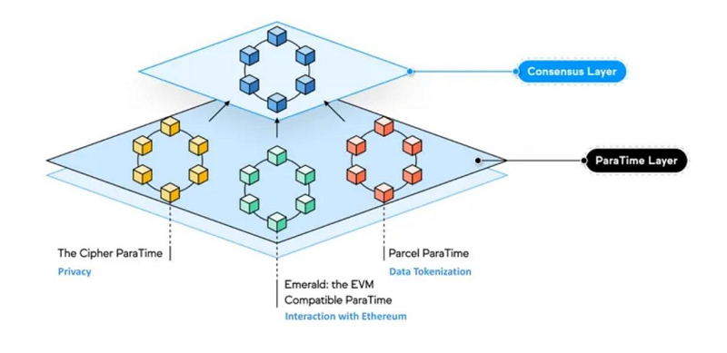
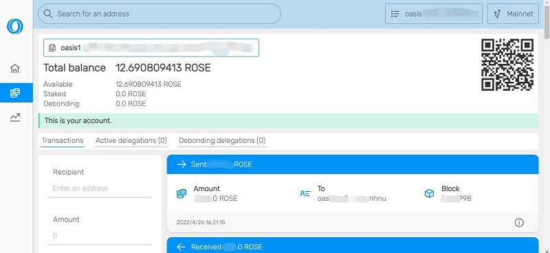
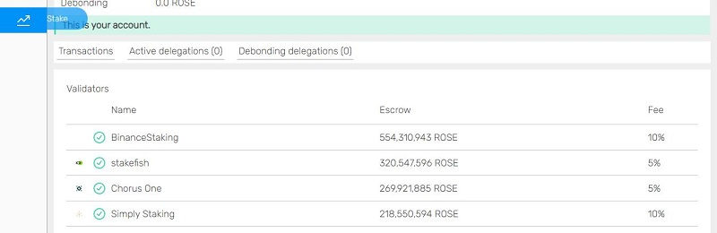
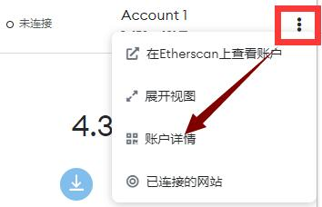

# 钱包

本文介绍Oasis的钱包分类、使用场景、适用功能等。

## 一、Oasis 分层结构

Oasis Network是于2020年11月19日上线的隐私公链。采用共识层与计算层分离的架构设计，能够实现可扩展性和灵活性，以部署低成本的以隐私为重点的智能合约。

共识层处理原生Token（ROSE）的转移、质押、委托及其他共识层事务，以及有限的Paratime更新条目值，Paratime层进行复杂计算，并将结果通过接口交给共识层，经过可验证计算验证后写入区块链。



目前使用的Paratime中，本视频中以Emerald为例（Emerald为EVM兼容架构的Paratime）。

## 二、钱包分类及使用场景

依据在不同分层中的适用性，钱包分为共识层钱包、Emerald钱包

- 共识层钱包主要用于ROSE代币在共识层内流转，以及质押；
- Emerald钱包用于参与Emerald上的各种生态。。

共识层钱包：web钱包、插件钱包、bitpie等第三方钱包

Emerald钱包：MetaMask等可添加RPC网络的第三方钱包（App或插件）

**插件钱包：可实现共识层与Paratime层的ROSE流转。**

<style>
   table th:first-of-type{
      width: 100px;
   }
</style>

|钱包名称|官方|共识层|Emerald|流转|备注|
|---|---|---|---|---|---|
|Oasis网页钱包|√|√||||
|Oasis插件钱包|√|√||√||
|Bitpie等||√||||
|MetaMask|||√|||

### 钱包地址

- Oasis插件钱包（Chrome浏览器） - ROSE管理、质押、主网与Emerald互转ROSE
   [https://chrome.google.com/webstore/detail/oasis-wallet/ppdadbejkmjnefldpcdjhnkpbjkikoip?hl=zh-CN](https://chrome.google.com/webstore/detail/oasis-wallet/ppdadbejkmjnefldpcdjhnkpbjkikoip?hl=zh-CN)
- Oasisweb钱包 - ROSE管理、质押
   [https://wallet.oasisprotocol.org/](https://wallet.oasisprotocol.org/)
- Metamask插件钱包（Chrome浏览器） - 使用Emerald网络里的ROSE，参与Emerald上的生态项目
   [https://chrome.google.com/webstore/detail/metamask/nkbihfbeogaeaoehlefnkodbefgpgknn?hl=zh-CN](https://chrome.google.com/webstore/detail/metamask/nkbihfbeogaeaoehlefnkodbefgpgknn?hl=zh-CN)
- App
   - [Bitpie钱包](https://bitpie.com/) - ROSE管理、质押
   - MetaMask App - 同Metamask插件钱包
- Emerald RPC

```
主网名称：Emerald Mainnet
RPC URL：https://emerald.oasis.dev/
ID:42262
代币：ROSE
```

## 三、web钱包

https://wallet.oasisprotocol.org/

打开钱包后，可以使用助记词、私钥或硬件钱包的方式登陆，或者新创建钱包。请注意必须备份好您的私钥。



- 右上角，为Mainnet与Testnet切换，应保持在Mainnet
- 中上部，为钱包地址、余额等
- 下方为钱包的近期交易数据

在左侧中选择 Staking，可以看到质押相关的操作。具体内容请参照本文第五部分。




## 四、插件钱包，共识层与Emerald互转ROSE

https://chrome.google.com/webstore/detail/oasis-wallet/ppdadbejkmjnefldpcdjhnkpbjkikoip?hl=zh-CN

请参照[Oasis与Emerald之间的ROSE划转](/dev_support/Oasis与Emerald之间的ROSE划转/Oasis与Emerald之间的ROSE划转.md)

上文中需要补充一下几点操作

### 兼容钱包是什么？

Emerald 为 EVM 架构，因此助记词、私钥、地址等，均与ETH、BSC 链相同。因此可以直接使用这两个链上的助记词、私钥、地址等信息。

因为兼容钱包仅支持私钥导入，以下介绍 MetaMask 私钥的获取方式。

**插件版**

点击账户右侧的“三点”，进入“账户详情”，可以看到“导出私钥”



**App版**

进入“设置”、“安全与隐私”，可以看到“显示私钥”

## 五、质押

详情请查阅 

## 六、bitpie 钱包转移到官方钱包

### 钱包区别

在区块链中，钱包地址对应着资产，私钥对应资产的所有权。助记词，顾名思义，是为了更方便的记住私钥。
助记词使用不同的算法，来生成私钥，所以同样的助记词，使用不用的算法，生成的私钥是不相同的。也就对应着不同的区块链链上地址。

私钥与钱包地址是一一对应的，而“助记词+算法”与私钥一一对应。

Bitpie钱包与官方钱包使用相同的BIP39算法,但未使用ARD-0008标准，因此同样的助记词，在两个钱包内对应的钱包地址不一样。

### 转移方法

从Bitpie钱包转移到官方钱包，可以选择以下两种做法:
从Bitpie钱包内，导出私钥（收款-右上角-显示私钥），然后用私钥在官方钱包内打开

在官方钱包内创建新的钱包，在Bitpie钱包内将ROSE转移到新的官方钱包地址

### 注意事项

链上资产不会无故丢失，请不要惊慌。请务必保管好助记词/私钥，也需要知道不同的钱包/客户端使用的“助记词生成私钥”的算法会有所不同。

Bitpie钱包可以导出私钥，然后导入到Oasis钱包内使用。但Bitpie钱包不支持导入Oasis的私钥或助记词来在Bitpie钱包内使用。因此需要使用转账的方式，将ROSE从官方钱包，转账到Bitpie钱包的新地址中。

官方web钱包近期出现问题，建议使用插件钱包或Bitpie钱包

> moi 2022/07/15