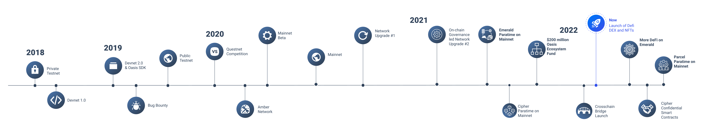
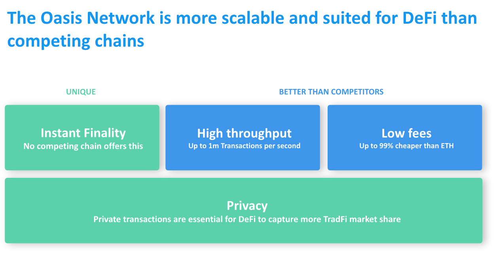
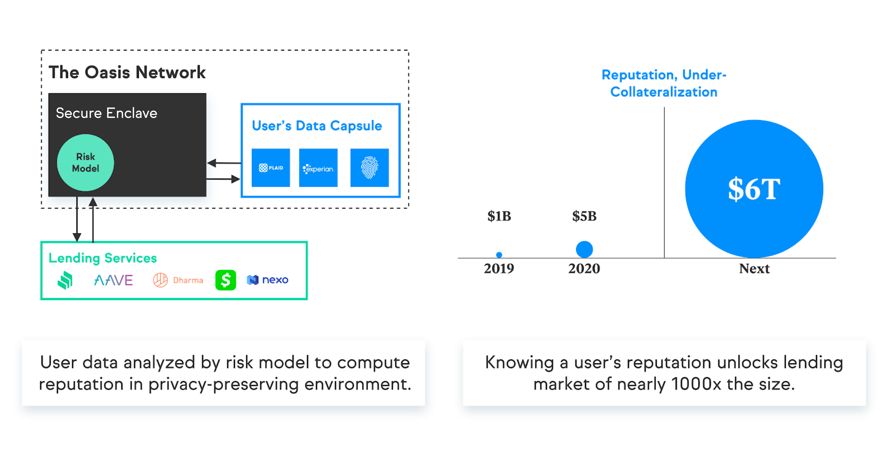
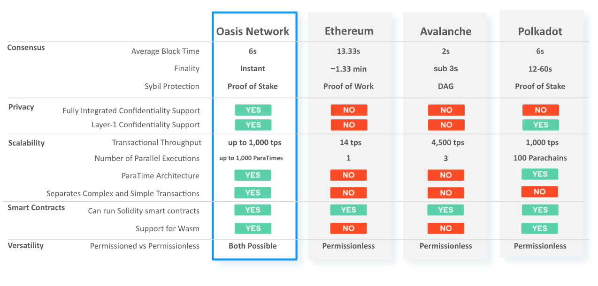
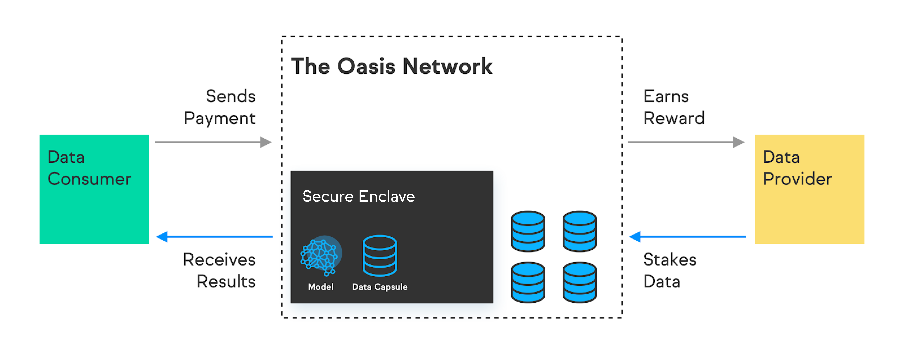
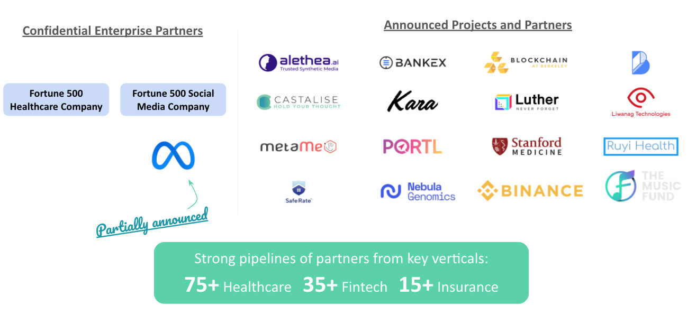
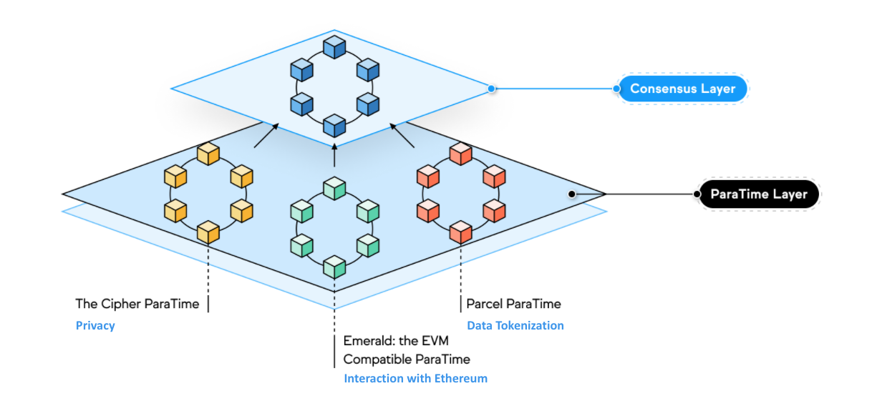
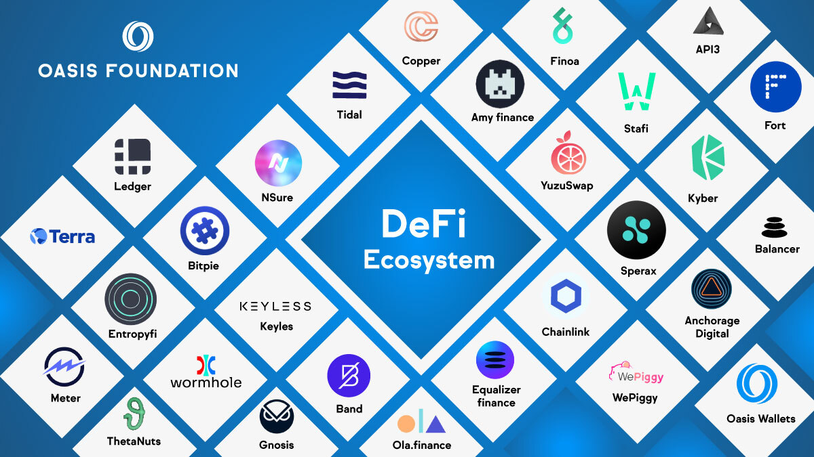
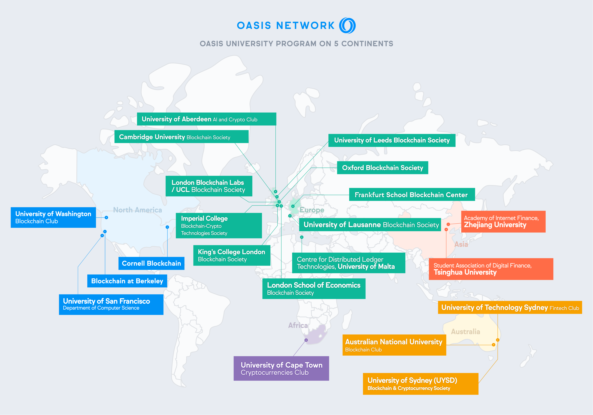
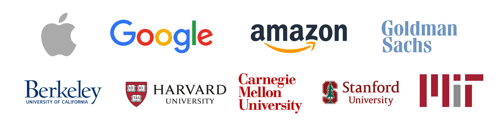

# 为什么选择 Oasis

> 提示
> 本文件中包含的信息可能会发生更改。本文档旨在提供最新的与Oasis网络和该网络的ROSE代币相关的关键信息的概述。更多信息，请访问我们的网站 www.oaisprotocol.org.

## 网络概览​
Oasis网络为下一代区块链而设计，是第一个为开放金融、负责任的数据经济和web 3而构建的隐私区块链平台。结合其高吞吐量和安全架构，Oasis网络将为私有、可扩展的DeFi提供动力，彻底改变开放金融，并将其从贸易商和早期采用者扩展到大众市场。其独特的隐私功能不仅将重新定义DeFi和Web 3，还将创建一种称为标记化数据的新型数字资产。这将使用户能够控制他们生成的数据，并通过应用程序获得奖励，创造有史以来第一个负责任的数据经济。

### 为什么是Oasis网络?​

**隐私赋能的区块链：** Oasis网络是世界上领先的可扩展、支持隐私的区块链。Oasis网络上的Paratime可以利用隐私保护技术，使用户能够共享数据以赚取收入，同时将其完全保密，从而为区块链解锁数字身份和隐私元宇宙应用等新的Web 3用例。

**可扩展性、隐私 DeFi：** DeFi市场仍处于初级阶段，现有金融市场中的数万亿美元已准备好进入该领域。由于缺乏隐私、安全性以及高昂的费用，DeFi的扩张受到限制。其结果是一个超负荷且昂贵的系统，无法扩展。Oasis网络是一个Layer 1区块链，可以将DeFi从早期采用者扩展到大众市场采用。

**允许隐私代币化：** Oasis网络可以把数据代币化。这将解锁区块链中足以改变游戏规则的使用案例，以及为网络上的应用和项目解锁全新的生态系统，为下一代隐私优先的应用提供动力，奖励用户创造的价值。

**快速增长的社区：** Oasis网络拥有一个由节点运营商、开发人员、企业合作伙伴、大使和参与全球社交渠道的社区成员组成的蓬勃发展的社区。

**顶尖团队：** Oasis团队由来自世界各地的顶尖人才组成，他们的背景来自苹果、谷歌、亚马逊、高盛、加州大学伯克利分校、卡内基梅隆大学、斯坦福大学、哈佛大学等等。所有核心工程团队都受过博士学位教育，都致力于扩大Oasis网络的影响力。

### 技术亮点

- **将共识和执行分为两层** ， Consensus Layer 和 ParaTime Layer，以实现更好的可扩展性和更高的通用性。
- 共识和执行的分离允许 **多个ParaTime并行处理事务** ，这意味着在一个ParaTime上处理的复杂工作负载不会降低在另一个ParaTime上处理的更快、更简单的事务的速度。
- **ParaTime层是完全去中心化的，允许任何人开发和构建自己的ParaTime** 。每个ParaTime都可以单独开发，以满足特定应用程序的需求，例如隐私计算、开放或封闭委员会等。
- 该网络高级的差异检测使**Oasis比分片和副链更高效**，只需要更小的复制因子就能达到相同的安全级别。
- **该网络广泛支持隐私计算技术**。Oasis Eth/WASI Runtime是一个开源的隐私ParaTime的示例，它使用安全飞地在处理数据时保持数据的私密性。
- **Oasis核心团队已经在网络上建立了3个Paratime**
    - **Emerald ParaTime, EVM兼容的ParaTime**是为了解决Solidity开发者面临的问题而开发的。高费用和低吞吐量。与以太坊相比，Emerald将事务吞吐量提高到每秒1000次，并将费用降低99%以上，从而解决了这两个问题。这意味着更多的用户将能够使用和构建网络。
    - **Cipher ParaTime, 隐私智能合约ParaTime**将保留Oasis以保护隐私而闻名的智能合约功能。与Emerald一样，它拥有高吞吐量、即时终结性和低费用，并增加了隐私保护功能。Cipher使DEX能够停止之前运行的交易，NFT用户能够秘密地保护他们的资产，并有可能在信贷和借贷市场从传统金融中解锁数万亿美元。
    - **作为隐私数据存储、治理和计算的ParaTime，Parcel**已经有了Nebula Genomics、Genetica和BMW等企业合作伙伴，使用它存储人类基因组数据等私有数据。Parcel支持数据的管理、机密计算和隐私分析。应用程序开发人员可以使用Parcel SDK聚合隐私保护的数据存储、治理和计算到他们的应用程序中。Parcel也是数据代币化引擎，可以将任何数据文件转换为NFT。我们设想这种功能可以让人们收回对他们创建的数据的控制权，将其转化为他们可以投资并获得回报的资产，从而创造一种新的负责任的数据经济。

## 新的应用领域​

### 可扩展的、隐私 DeFi​

DeFi市场仍处于初级阶段，现有金融市场中的数万亿美元已准备好进入该领域。由于缺乏隐私、安全性和高昂的费用，DeFi的扩张受到限制。其结果是一个超负荷且昂贵的系统，无法扩展。

Oasis网络是DeFi应用的理想选择，因为它具有可扩展性、即时终结性、比以太坊低99%的天然气费用，以及高吞吐量的特性。

Oasis网络旨在支持隐私智能合约，在处理数据时保持数据的私密性。通过在区块链上提供端到端数据保密性，绿洲网络在DeFi中解锁了新的令人兴奋的用例。从抵押贷款不足到防止front/back运作，绿洲网络可以帮助将DeFi从交易员和早期采用者扩展到主流市场。

该网络的顶尖的可扩展性功能有助于在今天的工作中解除对DeFi的封锁，解决目前困扰其他Layer 1网络的高交易费用和低吞吐量问题。总体来看，Oasis提供可扩展的隐私DeFi的独特能力预计将使其成为解锁下一代DeFi市场和用例的领先平台。

### 数据代币化 & 负责任的数据生态​

Oasis网络将隐私计算和区块链结合起来，实现了一种称为标记化数据的新范式。区块链允许记录和执行具有高度完整性和“可审核性”的使用策略。隐私计算确保数据在计算期间保持私密，未经许可不得重复使用。这一数据+政策组合创造了一种新的可消费数字资产，以及创造了收费或价值交换的具体指南。

通过代币化数据，Oasis网络可以为下一代隐私优先应用程序提供动力，并开启一个新的负责任的数据社会。Oasis网络上的数据提供商可以将他们代币化了的数据投入使用。他们可以通过将数据质押给想要分析数据的应用或者控制最敏感的信息是如何被所使用的服务消耗的，来获得奖励。

许多项目已经开始在Oasis上构建利用数据代币化了的应用程序。以下是几个案例：

> 案例研究: 币安 CRYPTOSAFE 联盟

> 加密盗窃和攻击越来越多，交易所需要一个平台来识别和禁止恶意行为。CryptoSafe平台由Oasis实验室和Binance开发，允许交易所共享威胁情报数据。由于Oasis网络对隐私计算的支持，交换数据即使在进行比较时也会保持私密。

> 案例研究: 财富500强医疗保健提供商

> 一家财富500强医疗保健提供商希望与外部机构共享数据，同时保留对数据的控制权，并保护患者数据的机密性。使用Oasis实验室构建的API，这家领先的医疗保健公司能够跟踪、记录和控制数据使用情况，即使是在与第三方共享时。

> 案例研究：NEBULA GENOMICS

> Nebula Genomics希望通过让用户控制自己的基因数据，将自己的产品与其他竞争对手区分开来。使用Oasis的框架，客户可以保留其基因组数据的所有权，而Nebula Genomics可以在不查看客户原始信息的情况下对数据进行分析。

## 技术概览

Oasis 网络是去中心化的基于权益证明的 Layer 1 区块链网络。该网络有两个主要的架构组件，共识层和ParaTime层。
- **共识层** 由一组去中心化的验证节点来运行具有可扩展、高吞吐量、安全、基于权益证明（Proof-of-Stake）的共识。
- **ParaTime层** 托管许多并行运行态（ParaTimes），每个运行态代表一个计算环境的拷贝，各计算环境之间共享状态。

### 可扩展性​

Oasis 网络令人印象深刻的可扩展性是通过一组高精尖技术实现的，这些技术提供比其他网络更快的交易速度以及更高的吞吐量。 网络的顶层性能很大程度上归功于将计算和共识操作分离到共识层和ParaTime层。 这种分离允许多个 ParaTime 并行处理事务，这意味着在某个处理复杂工作负载的 ParaTime 不会减慢另一个处理更简单更快速事务的 ParaTime。 此外，Oasis 网络高级的差异检测技术使得其比分片和平行链更有效 —— 即只需要更小的复制因子就能实现相同的安全级别。

### 隐私至上

Oasis 网络设计了Cipher，是第一个支持隐私智能合约的隐私 ParaTime。在隐私 ParaTime 中，节点被要求使用一种称为 TEE（可信执行环境）的安全计算技术。TEE 在隐私 ParaTime 中作为假设黑匣执行智能合约。加密数据与智能合约一起进入黑匣子进行解密，由智能合约处理，然后在发送出TEE之前再次加密。 该过程可确保数据保持私密，并且永远不会泄露给节点运营商或应用程序开发人员。

Oasis Eth/WASI 运行时是使用英特尔 SGX 的隐私ParaTime的开源示例。 也可以使用其他安全计算技术，例如 ZKP、HE 或其他安全飞地。 在未来，我们希望支持其他计算技术，例如安全多方计算、联邦学习等。

Oasis 网络的隐私性使得应用程序可以使用个人或敏感数据，例如他们的社会安全号码、银行对账单、健康信息，从而解锁了区块链上的一系列新的用例——这在其他Layer 1网络上是非常危险的。

隐私性解锁了区块链上的一系列新用例。个人或敏感数据，如身份证件、社会安全号码、银行对账单、财务和信用记录、健康信息、互联网使用数据、物联网数据，如健身记录和位置数据，都可以被Oasis网络上的应用程序使用，同时保护用户的隐私。即使在今天，连接所有这些数据源也是做梦都想不到的事情，尤其是在现有的公共 Layer 1 区块链上。有了Oasis，保密性和数据标记化将使人们能够安全地、私下地共享他们的数据，将他们每天创建的数据转化为创收资产。

### 多功能性
Oasis 旨在支持下一代区块链应用程序，具有令人难以置信的通用性、敏捷性和可定制性。 也就是说，每个 ParaTime 都可以单独开发，以满足特定应用程序的需求。 ParaTime 社区可以变大或变小，开放或封闭，从而根据特定用例的要求更快或更安全地执行。也可以要求节点具有特定的硬件，例如要求安全飞地运行在隐私 ParaTime 中。 每个 ParaTime 都可以类似地运行不同的运行时 VM（ParaTime 引擎），例如 EVM 向后兼容引擎、基于 Rust 的智能合约语言或数据标记化引擎。 最后，为了支持企业和开发人员的使用，ParaTimes 可以设置为需要验证的或无需验证的 —— 允许联盟拥有自己封闭的 ParaTime，或者允许社区拥有完全去中心化的开放 ParaTime。

ParaTime 层的多功能性使 Oasis 网络能够扩展和发展，以解决广泛的新的和令人兴奋的使用场景，同时仍然保持相同的核心分类账和共识层。

## 相关资料
### 研究论文
- [Digital Stewardship Research Paper](https://docsend.com/view/en2guc7dm6qksaa7)
- [Oasis Blockchain Platform Research Paper](https://docsend.com/view/aq86q2pckrut2yvq)
- [Confidential Compute Research Paper](https://docsend.com/view/3aznduk)
- [Shades of Finality Paper](https://arxiv.org/abs/2201.07920)

### 文档和技术支持
- [GitHub](https://github.com/oasisprotocol)
- [Documentation](https://docs.oasis.dev/)
- [Discord](https://discord.gg/RwNTK8t)
- [Twitter](https://twitter.com/OasisProtocol)
- [Telegram](https://t.me/oasisprotocolcommunity)
- [Medium](https://medium.com/oasis-protocol-project)

### 开发者工具

Oasis网络拥有一套由我们社区开发的开发和网络工具。你可以在[这里](https://docs.oasis.dev/general/community-resources/community-made-resources)找到它们。

## 循迹和推选​

### 生态
Oasis网络拥有一个欣欣向荣、快速增长的生态系统，由业界领先的应用程序开发商、区块链基础设施团队、节点运营商、大学等组成。我们很自豪地在下表中强调我们的一些关键合作伙伴和社区成员：

### DeFi 生态
与EVM兼容的Paratime Emerald现在已在主网上上线，开发人员一直在发布新项目。在此，我们重点介绍最近在网络上建设的一些DeFi项目：

### 2亿美金的生态基金

Oasis基金会汇集了业内一些最大的支持者，包括Binance实验室、Pantera、蜻蜓资本、跳跃资本、电力资本等。他们都认同我们的愿景，即隐私是成功的Web 3的一个重要组成部分，并为希望在Oasis网络上构建下一代Web 3、DeFi、Metaverse、DAO和NFT项目的开发人员和项目筹集了2亿美元资金。
如果你想基于Oasis发展，你可以在[这里](https://medium.com/oasis-protocol-project/binance-labs-backs-the-oasis-ecosystem-fund-to-support-the-projects-building-on-oasis-network-f6bcb3be6ee4)阅读更多关于生态系统基金的信息，或者通过这里的[表格](https://airtable.com/shrSyNBumurHhf7cd)申请生态系统基金。

### 资助 & 开发加速器

Oasis基金会通过我们的资助与许多有才华的开发团队通过[资助](https://oasisprotocol.org/ecosystem-grants)项目和[开发加速器](https://oasisprotocol.org/dev-accelerator)项目 构建新的应用程序以及集成Oasis。这些措施包括：

- [Anthem (by Chorus One)](https://anthem.chorus.one/)
- [Alethea.ai: AI生成媒体的交易市场](https://medium.com/oasis-protocol-project/devaccelerator-spotlight-alethea-ai-aac8f854e436)
- [Bankex: 通过社交网络发送数字资产](https://medium.com/oasis-protocol-project/devaccelerator-spotlight-bankex-9bb127f9e449)
- [Castalise: 对药品数据进行隐私保护的预测分析](https://medium.com/oasis-protocol-project/devaccelerator-spotlight-castalise-347f155ab66f)
- [Chainflow Mission Control](https://github.com/Chainflow/oasis-mission-control-grant)
- [Dead Man’s Switch: 一个去中心化的、抵制审查的举报工具](https://medium.com/oasis-protocol-project/devaccelerator-spotlight-dead-mans-switch-32d07cdfc057)
- [Luther.ai: 构建人工智能以保留、强化、回忆并最终增强人类记忆。](https://luther.ai/)
- [Oasis.Fish (by Stakefish)](https://oasis.fish/leaderboard/)
- [Oasis Hubble (by Figment Networks)](https://hubble.figment.network/oasis/chains/amber)
- [Oasis Monitor (by Everstake)](https://oasismonitor.com/)
- [Oasisscan (by bitcat)](https://oasisscan.com/)
- [Oasis Smartstake (by Smartstake): 为Oasis网络提供验证服务](https://oasis.smartstake.io/)
- [Oasis Mobile Wallet by RockX
- [Ruyi Health: 为中风患者及其提供者和保险公司提供安全、直观、智能的健康管理解决方案。](https://medium.com/oasis-protocol-project/devaccelerator-spotlight-ruyi-health-7c068cfeecea)
- [SafeRate: 当社区房屋价值下降时自动减少抵押贷款支付](https://medium.com/oasis-protocol-project/devaccelerator-spotlight-saferate-2dbb99c3a43a)
- [SimplyVC Panic Monitoring](https://github.com/SimplyVC/panic_oasis)

### 社区的贡献
Oasis网络拥有一个蓬勃发展的社区，成员来自世界各地。这在一定程度上是由Oasis大使计划推动的，在该计划中，对Oasis网络充满热情的志愿者会举办会议、撰写和翻译内容、回答开发者问题、管理在线社区、对绿洲网络进行压力测试等。

大使们还在世界范围内发展壮大强大的社区，包括孟加拉国、越南、印度、巴西、韩国、尼日利亚、菲律宾、俄罗斯、中国、韩国、土耳其等。

Oasis网络还拥有所有 Layer 1 区块链中规模最大的大学项目，拥有超过25个顶级大学系、区块链俱乐部和其他横跨五大洲的项目。该项目的成员运行节点、构建应用程序等。参与的大学和大学生组织包括伯克利区块链、清华大学数字金融学生协会、剑桥大学区块链协会等。

### 贡献团队

Oasis团队由世界领先的研究人员、安全专家和隐私倡导者组成，他们共同努力构建一个负责任的数据经济平台。
[Oasis 基金​](https://www.linkedin.com/company/oasisprotocol/)
- [在我们的网站中查看团队页面](https://oasisprotocol.org/about-us)
[Oasis 实验室​](https://www.linkedin.com/company/oasis-labs)
- [Dawn Song, Founder](https://www.linkedin.com/in/dawn-song-51586033/)
- [Peter Gilbert, Director of Engineering](https://www.linkedin.com/in/peter-gilbert-2b70b1167/)

### 报道

自该公司退出隐形模式以来，已经报道了200多篇文章。热门文章和采访包括：

- [The New York Times: Building a World Where Data Privacy Exists Online](https://www.nytimes.com/2019/11/19/technology/artificial-intelligence-dawn-song.html)
- [WIRED: Oasis Labs' Dawn Song on a Safer Way to Protect Your Data](https://www.wired.com/story/dawn-song-oasis-labs-data-privacy-wired25/)
- [MIT Technology Review: How AI could save lives without spilling medical secrets](https://www.technologyreview.com/2019/05/14/239125/how-ai-could-save-lives-without-spilling-secrets/)
- [Yahoo! Finance: Web3 Users will Control Their Data, Says Oasis Ecosystem Head](https://www.yahoo.com/now/web3-users-control-data-says-132837055.html)
- [Cointelegraph: First DEX on Oasis Network hits $100M TVL in 24 hours](https://cointelegraph.com/news/first-dex-on-oasis-network-hits-100m-tvl-in-24-hours)
- [Cointelegraph: Binance Labs backs $200M Oasis Ecosystem Fund](https://cointelegraph.com/news/binance-labs-backs-200m-oasis-ecosystem-fund)
- [CoinSpeaker: Oasis Protocol Inks Partnership with Meta to Facilitate AI Computing Applications](https://www.coinspeaker.com/oasis-protocol-partnership-meta/)
- [Cointelegraph: AkoinNFT to Sell Historic DNA Data Art as NFT In Collaboration With Oasis Network](https://cointelegraph.com/news/akon-to-sell-historic-dna-data-art-as-nft-on-oasis-network)
- [Nature: How scientists are embracing NFTs](https://www.nature.com/articles/d41586-021-01642-3)
- [Cointelegraph: Concerns around data privacy are rising, and blockchain is the solution](https://cointelegraph.com/news/concerns-around-data-privacy-are-rising-and-blockchain-is-the-solution)
- [Coin Desk: The Educator-Entrepreneurs of Crypto](https://www.coindesk.com/business/2021/10/05/the-educator-entrepreneurs-of-crypto/)

关于Oasis网络的文章集中在各种主题上，涵盖主流媒体和加密媒体：

> 本文于2022/07/05翻译自[官方文档](https://docs.oasis.dev/oasis-network-primer/)。
